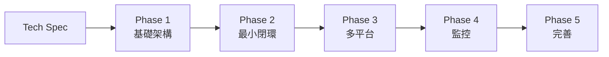

# 產品開發流程使用說明書 - Personal Content Distributor v2

> **版本:** v1.0 | **更新:** 2026-03-19 | **狀態:** 活躍

---

## 1. 使用原則

- **以文檔為契約**: 所有決策以文檔為單一事實來源 (SSOT)
- **小步快跑**: 優先小批量交付，保留 ADR 以利回溯
- **風險前置**: 用審查 Gate 降低重大偏差風險
- **模式可升降級**: MVP 可升級為完整流程

**角色:** PM/Lead Engineer: kuanwei (一人團隊)

---

## 2. 模式選擇

本專案採用 **MVP 快速迭代** 模式。

| 條件 | 評估 |
| :--- | :--- |
| 金流/法遵/隱私資料 | 無，社群公開貼文 |
| 高可用與規模化 | 不需要，個人使用 |
| 跨團隊協作 | 無，一人開發 |
| 快速驗證價值假設 | ✅ 驗證 Web 替代 Google Sheets 的可行性 |
| 時間/預算有限 | ✅ MVP 目標 2026-04-30 |

**升級觸發**: 多人使用、接入付費功能、DAU > 100

---

## 3. MVP 快速迭代流程



### Phase 0: Tech Spec (已完成)

已有完整文檔：
- PRD: `docs/project_brief_and_prd.md`
- 架構設計: `docs/architecture_and_design_document.md`
- API 設計: `docs/api_design_specification.md`
- BDD 場景: `docs/behavior_driven_development_guide.md`
- 模組規格: `docs/module_specification_and_tests.md`

### Phase 1-5: 迭代循環

每個 Phase 遵循：

```
/task-next → /plan → /tdd → /verify
```

1. **取得任務** (`/task-next`): 從 WBS 取得下一個優先任務
2. **規劃** (`/plan`): 建立實作計畫，等待確認
3. **開發** (`/tdd`): Red-Green-Refactor 循環
4. **驗證** (`/verify`): 測試通過、型別正確、安全檢查
5. **提交** (`git commit`): Conventional Commits 格式

### 每次交付標準

- 可運行版本 + 測試通過
- 安全最低限度: Secrets 不進原始碼、輸入驗證
- 可觀測性: 日誌 + `/health` 端點

---

## 4. 文檔產出對照

| 編號 | 文檔 | 狀態 | 用途 |
| :--- | :--- | :--- | :--- |
| 01 | 工作流手冊 (本文) | ✅ | 開發流程指南 |
| 02 | PRD | ✅ | 需求與範圍定義 |
| 03 | BDD 場景 | ✅ | 驗收標準 |
| 04 | ADR | ✅ | 技術決策記錄 |
| 05 | 架構設計 | ✅ | 系統架構 |
| 06 | API 設計 | ✅ | API 契約 |
| 07 | 模組規格 | ✅ | 服務介面與測試案例 |
| 08 | 專案結構 | ✅ | 目錄與檔案組織 |
| 09 | 檔案依賴 | ✅ | 模組間依賴關係 |
| 10 | 類別關係 | ✅ | 物件設計與模式 |
| 11 | Code Review | ✅ | 審查指南 |
| 12 | 前端架構 | ✅ | 前端技術規範 |
| 13 | 安全檢查 | ✅ | 安全與上線準備 |
| 14 | 部署運維 | ✅ | 部署與監控 |
| 15 | 文檔維護 | ✅ | 文檔管理指南 |
| 16 | WBS 計畫 | ✅ | 任務分解與進度 |
| 17 | 前端 IA | ✅ | 資訊架構與導航 |

---

## 5. Gate 度量

### MVP 上線 Gate

- [ ] P0 功能全部完成 (Web 貼文 CRUD + 3 平台發佈 + 狀態追蹤)
- [ ] 發佈成功率 ≥ 95%
- [ ] 測試覆蓋率 80%+
- [ ] 無 Critical/High 安全問題
- [ ] 有最小可運營 Runbook
- [ ] 資料備份已啟用
- [ ] 風險與債務列入後續 Backlog

---

## 6. 附錄: 日常開發檢查清單

- **開發前**: 確認任務優先級、檢查依賴是否就緒
- **開發中**: 先寫測試、不可變模式、函式 < 50 行
- **提交前**: TypeScript/Python 無錯誤、測試通過、無硬編碼秘密
- **Phase 完成**: 更新 WBS 狀態 (`/task-status`)、回顧與調整
