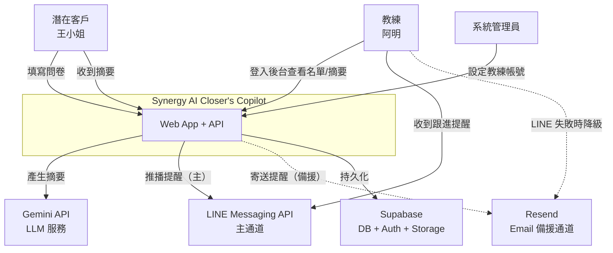
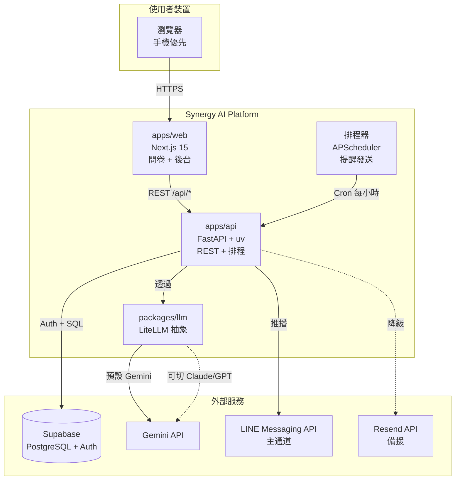
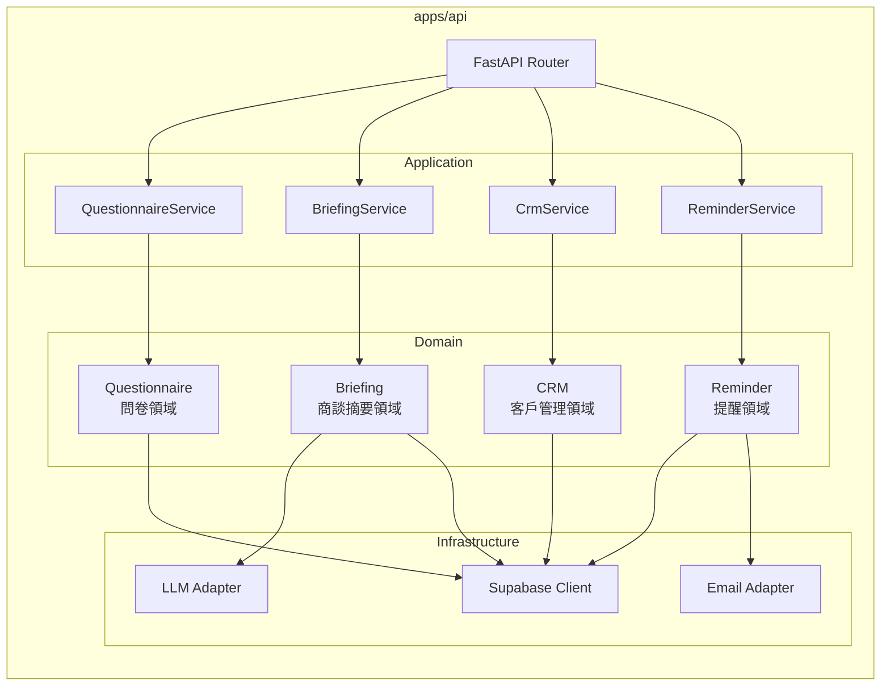
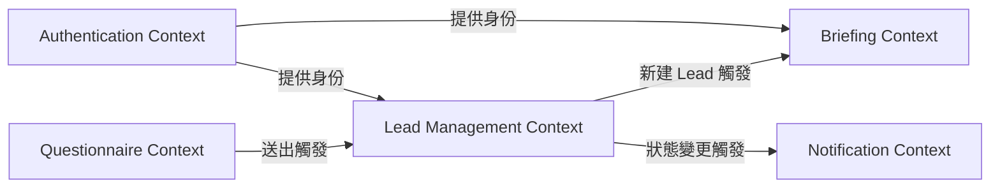
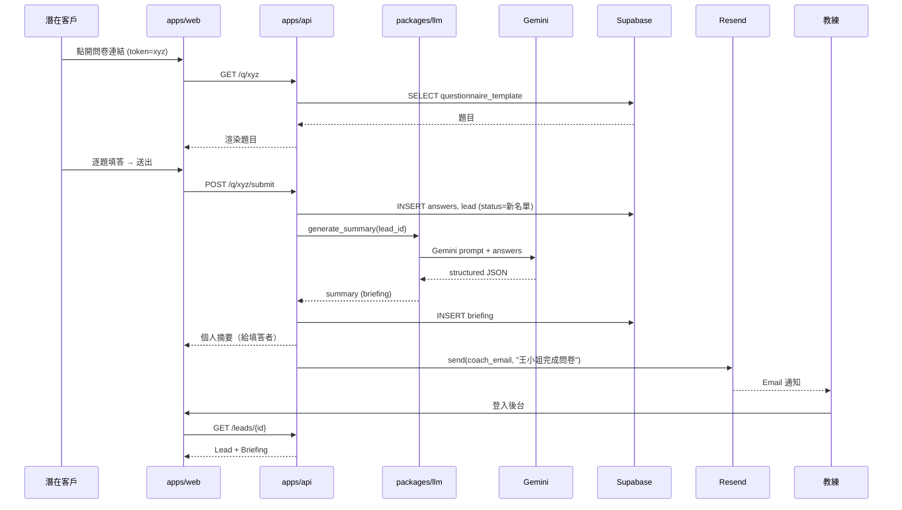
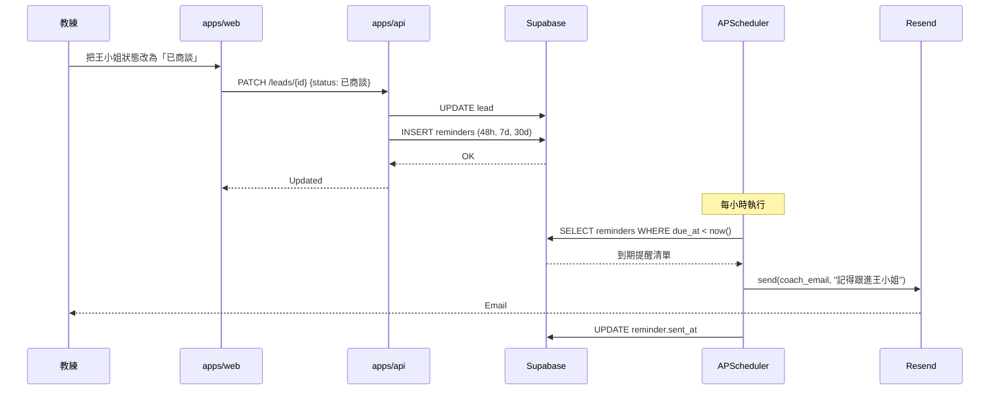
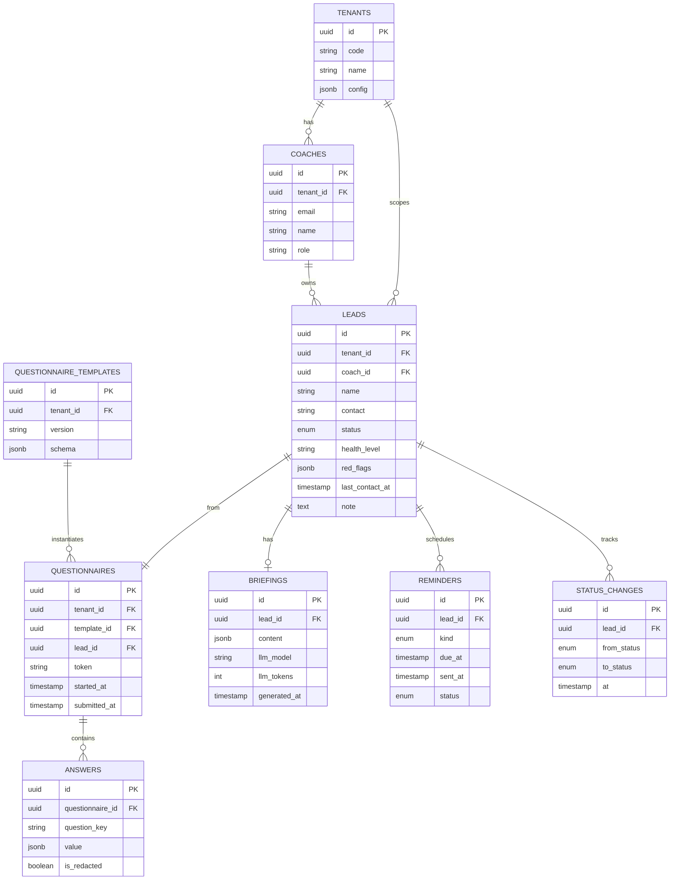
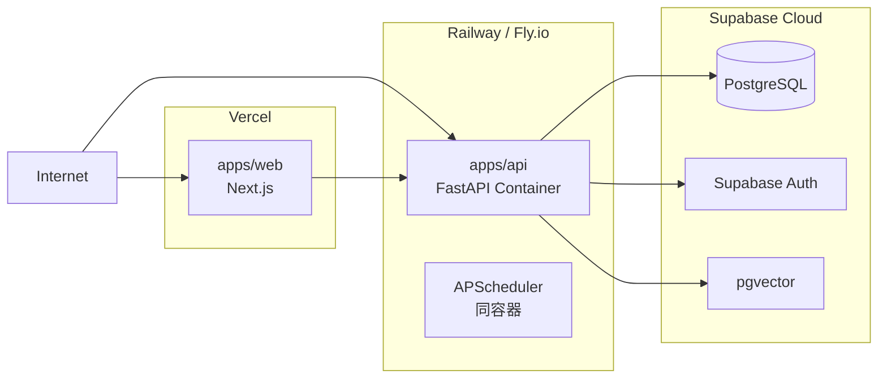
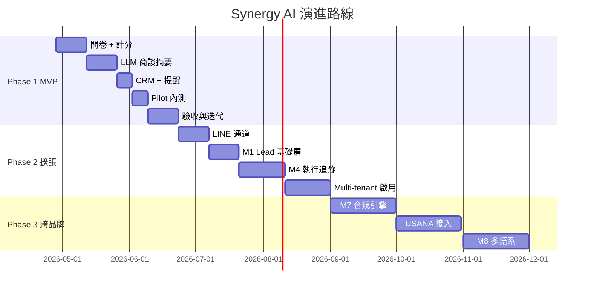

# 架構與設計文件 — Synergy AI Closer's Copilot

> **版本:** v1.0 | **更新:** 2026-04-24 | **狀態:** 草稿

---

## 第 1 部分：架構總覽

### 1.1 C4 模型

#### L1 系統情境圖



#### L2 容器圖



#### L3 元件圖（apps/api 內部）



---

### 1.2 DDD 戰略設計

#### 通用語言（Ubiquitous Language）

| 領域術語 | 定義 | 對應程式碼命名 |
| :--- | :--- | :--- |
| **問卷** (Questionnaire) | 一份填完的健康問卷實例 | `Questionnaire` entity |
| **題目** (Question) | 問卷中單一題目 | `Question` value object |
| **答案** (Answer) | 填答者對單題的回應 | `Answer` value object |
| **名單** (Lead) | 填完問卷後的客戶資料 | `Lead` entity |
| **健康等級** (Health Level) | A/B/C 評級結果 | `HealthLevel` enum |
| **紅旗** (Red Flag) | 健康風險警訊 | `RedFlag` value object |
| **商談摘要** (Briefing) | AI 生成給教練看的單頁摘要 | `Briefing` aggregate |
| **商談** (Consultation) | 教練與客戶的一次對話 | 狀態轉換，不獨立建模 |
| **客戶狀態** (Lead Status) | 新名單/已商談/已成交/未成交 | `LeadStatus` enum |
| **提醒** (Reminder) | 排程給教練的跟進通知 | `Reminder` entity |
| **教練** (Coach) | 系統使用者（經營者） | `Coach` entity = User |
| **租戶** (Tenant) | 未來多品牌隔離單位 | `Tenant` entity，MVP 固定 'synergy' |

#### 限界上下文（Bounded Context）



**Context Map 說明**：

| 上下文 | 核心職責 | 對應 Epic |
| :--- | :--- | :--- |
| **Questionnaire** | 題目管理、填答流程、計分規則 | Epic A |
| **Lead Management** | 名單 CRUD、狀態機、搜尋篩選 | Epic C |
| **Briefing** | LLM 摘要生成、快取、重新生成 | Epic B |
| **Notification** | 提醒排程、多通道發送、重試 | Epic D |
| **Authentication** | 教練登入、tenant 判定、權限 | 跨 Epic |

---

### 1.3 分層架構

MVP 採用 **Clean Architecture 精簡版**（3 層）：

| 層 | 內容 | 目錄 |
| :--- | :--- | :--- |
| **Domain** | Entity、Value Object、業務規則 | `apps/api/src/domain/` |
| **Application** | Use Case、Service、編排邏輯 | `apps/api/src/application/` |
| **Infrastructure** | DB、LLM、Email、HTTP Adapter | `apps/api/src/infrastructure/` |

**依賴方向**：Infrastructure → Application → Domain（向內依賴）。

---

### 1.4 技術選型

| 分類 | 選用技術 | 選擇理由 | 備選方案 | ADR |
| :--- | :--- | :--- | :--- | :--- |
| 後端框架 | FastAPI + Python 3.12 + uv | 延用 module2；async 原生、Pydantic 整合 | Django、Flask | ADR-001 |
| 前端框架 | Next.js 15 + React 19 + Tailwind v4 | 延用 module2 UI；Apple tokens 已建 | Vite+React、Remix | ADR-001 |
| 資料庫 | Supabase Cloud（PostgreSQL + pgvector） | RLS、Auth、pgvector 免費層 | 自架 PG、PlanetScale | ADR-003 |
| 認證 | Supabase Auth（Magic Link） | 內建、省時 | Clerk、Auth0 | ADR-003 |
| LLM | Gemini-2.5-flash via LiteLLM | 成本最低、抽象層可切 | Claude Opus 4.6 | ADR-004 |
| 訊息通道（主） | LINE Messaging API | 台灣教練日常慣用、開信率最高 | WhatsApp（非台灣） | ADR-008 |
| 訊息通道（備援） | Resend（Email） | LINE 失敗時降級、3k 免費 | SendGrid、SES | ADR-008 |
| 排程 | APScheduler（Python in-process） | 單機夠用、Pilot 量小 | Celery、Temporal | — |
| CI/CD | GitHub Actions | 標準 | GitLab CI | — |
| 部署 | Railway / Fly.io | Python + Postgres 相容 | Vercel（僅前端）+ Railway | — |
| 可觀測性 | Sentry + Supabase Logs | 入門足夠 | Datadog、PostHog | — |

---

## 第 2 部分：需求摘要

### 功能性需求（由 PRD 收斂）

| ID | 需求 | 對應 US |
| :--- | :--- | :--- |
| FR-1 | 潛在客戶可填寫並送出健康問卷 | US-A01, A02 |
| FR-2 | 問卷送出後 30 秒內產生個人摘要 | US-A01 |
| FR-3 | 教練在 Lead 建立後 30 秒內收到通知 | US-A03 |
| FR-4 | 教練可打開商談前 AI 摘要頁 | US-B01, B02, B03 |
| FR-5 | 教練可列表、搜尋、篩選客戶 | US-C01 |
| FR-6 | 問卷送出自動在 CRM 建檔 | US-C02 |
| FR-7 | 教練可更新客戶狀態（狀態機） | US-C03 |
| FR-8 | 系統於商談後 48h/7d/30d 自動發送提醒 | US-D01 |
| FR-9 | 成交後自動取消未發送提醒 | US-D02 |
| FR-10 | 提醒透過 LINE（主通道），Email 作為備援 | US-D03 |

### 非功能性需求

| 分類 | 需求描述 | 目標值 |
| :--- | :--- | :--- |
| 性能 | 問卷頁載入 | < 2s（3G 網路） |
| 性能 | API p95 延遲（非 LLM） | < 500ms |
| 性能 | LLM 摘要生成 | < 30s |
| 可擴展性 | 同時線上教練數 | ≥ 10（Pilot 期） |
| 可擴展性 | 月問卷量 | ≥ 500（容量上限） |
| 可用性 (SLA) | MVP Pilot 階段 | ≥ 95% |
| 安全性 | 傳輸 | TLS 1.3 |
| 安全性 | 認證 | Supabase Magic Link + JWT |
| 安全性 | 敏感資料 | 健康欄位 DB 層加密（Phase 2） |
| 可維護性 | 測試覆蓋率 | ≥ 80% |
| 可維護性 | 文件更新 | 與 code 同步提交 |

---

## 第 3 部分：系統設計

### 3.1 架構模式

- **模式**：模組化單體（Modular Monolith）+ 扁平 Monorepo
- **選擇理由**：
  - MVP 量小，微服務是過度工程
  - 單體內按 Bounded Context 分模組，Phase 2 要拆時邊界清楚
  - Monorepo 方便共用型別與 UI

### 3.2 系統元件圖

已於 1.1 L2/L3 呈現。

### 3.3 元件職責

| 元件 | 核心職責 | 技術 | 依賴 |
| :--- | :--- | :--- | :--- |
| `apps/web` | 問卷填答 UI + 教練後台（CRM + 摘要頁） | Next.js 15 / React 19 | `packages/ui`、`packages/domain` |
| `apps/api` | REST API + 排程器 | FastAPI / uv | Supabase、`packages/llm` |
| `packages/domain` | 共用型別（TS + Pydantic dual） | TypeScript + Python | — |
| `packages/llm` | LLM 抽象 + prompt 模板 | Python / LiteLLM | Gemini/Claude API |
| `packages/ui` | 共用 React 元件（Button、Card、Form） | React + Tailwind | Apple UI tokens |
| Supabase | DB + Auth + Storage | Managed SaaS | — |
| APScheduler | 每小時掃描提醒 | In-process Python | Supabase（讀排程） |

### 3.4 關鍵使用者旅程（資料流）

#### 場景 1：潛在客戶填完問卷 → 教練收到結構化名單



#### 場景 2：教練商談後更新狀態 → 自動排程提醒



---

## 第 4 部分：資料架構

### ER 模型（核心表）



### 關鍵資料設計決策

| 欄位 / 表 | 設計 | 理由 |
| :--- | :--- | :--- |
| 所有表 `tenant_id` | 必填、FK 到 tenants | ADR-005 預留 multi-tenant |
| `answers.value` | JSONB | 支援單選/多選/文字/數字混合；避免每種類型一張表 |
| `briefings.content` | JSONB（痛點/推薦/異議/切入） | 結構化輸出，前端直接 render |
| `leads.red_flags` | JSONB array | 內容可變、不需外鍵查詢 |
| `reminders.kind` | enum('48h','7d','30d') | MVP 固定三種 |
| `leads.status` | enum('new','talked','closed_won','closed_lost') | 狀態機 |
| `questionnaires.token` | UUIDv4，30 天 TTL | 填答者可用連結，不需登入 |

### 一致性策略

- **強一致**：Lead 狀態變更、提醒建立（同交易）
- **最終一致**：Briefing 生成（非同步，失敗可 retry）
- **冪等性**：`generate_summary(lead_id)` 可重跑，以 `briefings.lead_id UNIQUE` 保證

### 資料分類與合規

| 資料類型 | 敏感度 | 儲存策略 | 保留期 |
| :--- | :--- | :--- | :--- |
| 教練 email、name | 中 | 明文（Supabase Auth 管理） | 帳號存續 |
| 客戶姓名、聯絡方式 | 中 | 明文（MVP）；Phase 2 改為欄位層加密 | 1 年（GDPR friendly） |
| 健康問卷答案 | 高 | JSONB，Supabase RLS 隔離 | 1 年；可主動刪除 |
| LLM 生成摘要 | 高 | JSONB，權限同答案 | 同上 |
| 稽核日誌 | 低 | Supabase Logs | 30 天 |

**合規要點**：
- 問卷首頁標註：「本資料僅供教練參考，非醫療診斷」
- 問卷完成頁提供「刪除我的資料」連結
- 填答者可選擇不揭露（`is_redacted = true`）

---

## 第 5 部分：部署與基礎設施

### 部署視圖



### CI/CD 流程

```
PR Created
  ├─ Lint (ruff + eslint)
  ├─ Type Check (mypy + tsc)
  ├─ Unit Tests (pytest + vitest)
  └─ BDD @smoke-test

Merge to main
  ├─ Build apps/web → Vercel Preview
  ├─ Build apps/api → Railway Staging
  └─ Post deploy smoke test

Tag v*.*.*
  └─ Deploy to Production (Railway + Vercel)
```

### 環境策略

| 環境 | DB | API URL | Web URL | 用途 |
| :--- | :--- | :--- | :--- | :--- |
| local | Supabase local | localhost:8000 | localhost:3000 | 開發 |
| staging | Supabase free project | api-staging.synergy-ai.tw | staging.synergy-ai.tw | 內部驗證 |
| production | Supabase Pro | api.synergy-ai.tw | app.synergy-ai.tw | Pilot 使用 |

### 成本估算（Pilot 階段，月度）

| 項目 | 成本 (NTD) | 備註 |
| :--- | :--- | :--- |
| Supabase Free | 0 | < 500 MB / 50k users |
| Gemini API | 50-200 | 100 份問卷 × 2 次 LLM |
| LINE Messaging API | 800 | Light plan 15k 訊息 |
| Resend（備援） | 0 | < 3,000 封/月 |
| Railway（API） | 150-500 | Hobby plan |
| Vercel（Web） | 0 | Hobby plan |
| 網域 + SSL | 60 | .tw 網域 |
| **合計** | **1,060-1,560** | |

---

## 第 6 部分：跨領域考量

### 可觀測性

- **日誌**：Structlog（Python）+ Pino（Node）統一 JSON 格式，收集到 Sentry + Supabase Logs
- **指標**：Supabase 內建（連線、查詢時間）+ 應用層自訂
  - SLI: 問卷送出成功率、摘要生成成功率、提醒送達率
  - SLO: 成功率 ≥ 99%；p95 延遲 ≤ 目標
- **追蹤**：Sentry APM（Python + JS 統一）
- **告警**：
  - CRITICAL：API error rate > 1%、LLM 失敗 > 5%、DB 連線失敗
  - WARN：月成本超預算 80%、佇列堆積

### 安全性

- **威脅模型**：
  - 主要威脅：問卷連結被猜出、教練看別人的客戶、LLM prompt injection
  - 緩解：UUIDv4 token（2^122 空間）、Supabase RLS、LLM 輸入 sanitize
- **認證授權**：Supabase Magic Link + JWT + RLS policy
- **機密管理**：Vercel/Railway 環境變數 + 1Password 團隊保管庫
- **網路安全**：Cloudflare CDN + rate limit（問卷 token 每 IP 每分鐘 10 次）

---

## 第 7 部分：風險與演進

### 風險（參見 PRD §6 詳列）

| 風險 | 可能性 | 影響 | 緩解策略 |
| :--- | :--- | :--- | :--- |
| LLM 品質不足 | MED | HIGH | W2 評估後切 Claude；prompt 迭代 |
| Pilot 採用度低 | MED | HIGH | W0 教學 + W2 訪談 |
| 合規（個資） | LOW | MED | 問卷聲明 + 刪除權 |
| 成本失控 | LOW | LOW | 月成本告警 + 降級策略 |
| Phase 2 架構限制 | MED | HIGH | 本 MVP 已做 tenant_id 與 LiteLLM 抽象 |

### 演進路線



- **Phase 1 (MVP, 6-8 週)**：問卷 + 商談摘要 + CRM + Email 提醒
- **Phase 2 (擴展, 3-6 個月)**：LINE 通道、M1 Lead 基礎、M4 執行追蹤、啟用 multi-tenant
- **Phase 3 (跨品牌, 6-12 個月)**：合規引擎、USANA 接入、多語系

---

## 第 8 部分：模組詳細設計

### MVP 範圍

- 關鍵模組：Questionnaire、Lead、Briefing、Reminder、Auth
- 後續模組：Notification Channel、Campaign（M1）、Tracking（M4 進階）

### 模組：Questionnaire

- **對應 BDD**：`docs/02_bdd.md §1 questionnaire.feature`
- **職責**：題目版本管理、填答進度持久化、計分規則引擎
- **API 設計**：→ `docs/05_api.md §2`
- **資料模型**：`questionnaire_templates`、`questionnaires`、`answers`
- **關鍵邏輯**：
  - 計分規則以 YAML 版本化存於 `apps/api/rules/questionnaire-v1.yaml`
  - 健康等級 = f(風險項總分)，A/B/C 界線 config 化

### 模組：Briefing

- **對應 BDD**：`docs/02_bdd.md §2 briefing.feature`
- **職責**：LLM 調用、結構化輸出驗證、快取管理
- **API 設計**：→ `docs/05_api.md §3`
- **資料模型**：`briefings`
- **關鍵邏輯**：
  - Prompt 版本化於 `packages/llm/prompts/briefing-v1.py`
  - 輸出必過 Pydantic schema 驗證，否則重試 2 次

### 模組：Lead (CRM)

- **對應 BDD**：`docs/02_bdd.md §3 crm.feature`
- **職責**：名單 CRUD、狀態機、搜尋篩選
- **API 設計**：→ `docs/05_api.md §4`
- **資料模型**：`leads`、`status_changes`
- **關鍵邏輯**：狀態機於 `apps/api/src/domain/lead/status_machine.py`

### 模組：Reminder

- **對應 BDD**：`docs/02_bdd.md §4 reminder.feature`
- **職責**：排程建立、到期掃描、多通道發送、重試
- **API 設計**：→ `docs/05_api.md §5`
- **資料模型**：`reminders`
- **關鍵邏輯**：
  - 狀態變更時觸發 `schedule_reminders(lead_id)`
  - APScheduler 每小時跑 `scan_due_reminders()`
  - 成交時觸發 `cancel_pending_reminders(lead_id)`

### NFR 實現

- **性能**：
  - Briefing 預先生成 + 快取（ADR-009）
  - DB index：`leads(coach_id, status)`、`reminders(due_at) WHERE sent_at IS NULL`
- **安全**：
  - RLS policy：每表 `tenant_id = current_tenant() AND coach_id = current_user()`
  - API rate limit：問卷 token 10 req/min/IP、教練 60 req/min
- **可擴展**：
  - LLM 層抽象（ADR-004），未來加 Claude / GPT 切換無需改 domain
  - 訊息通道抽象（`NotificationChannel` Protocol + LINE / Email 兩個 adapter），Phase 2 可接 WhatsApp / Telegram 無痛
  - 通道 fallback 策略於 Application 層，Domain 不感知通道種類
