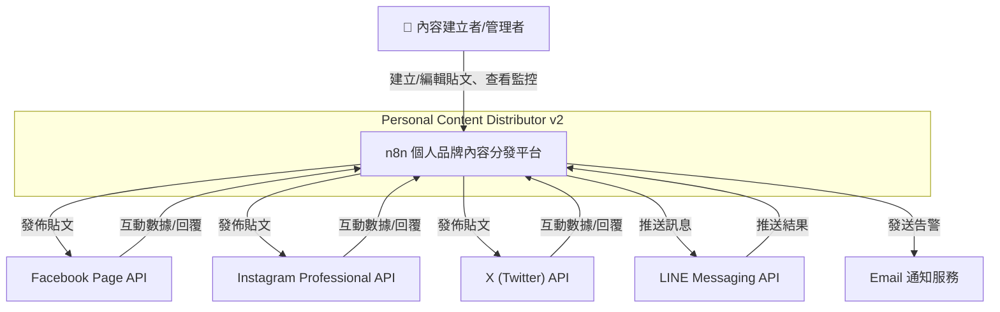
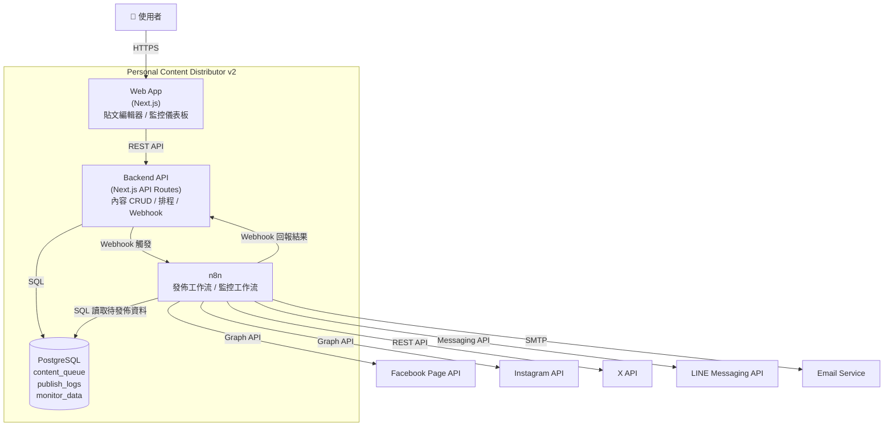
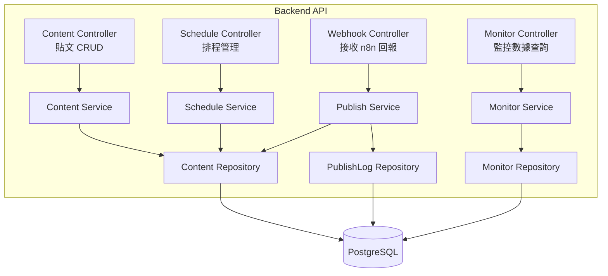
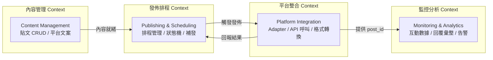
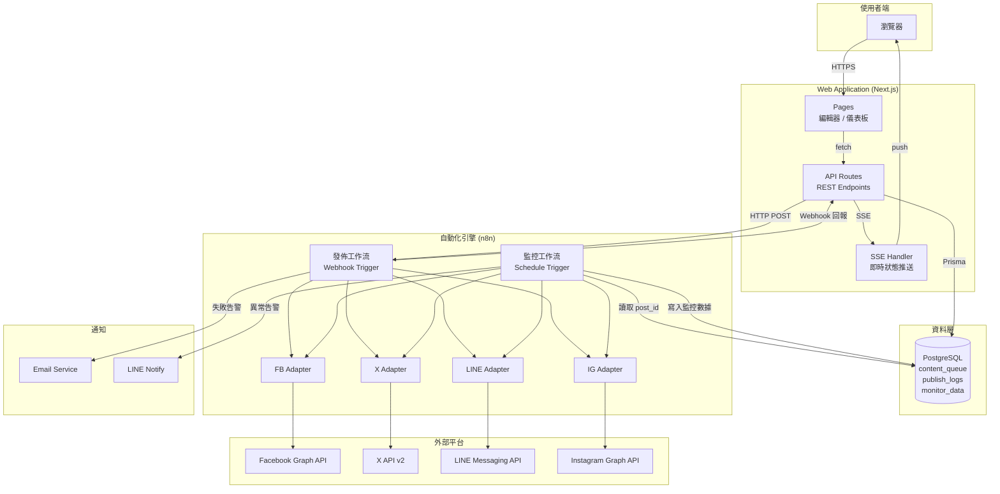
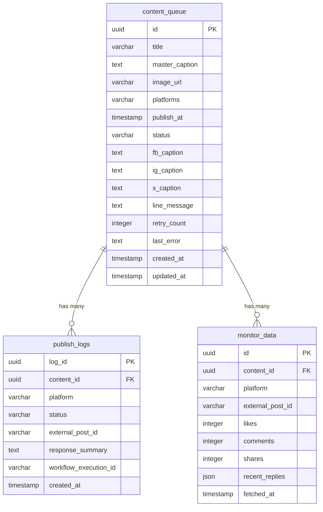
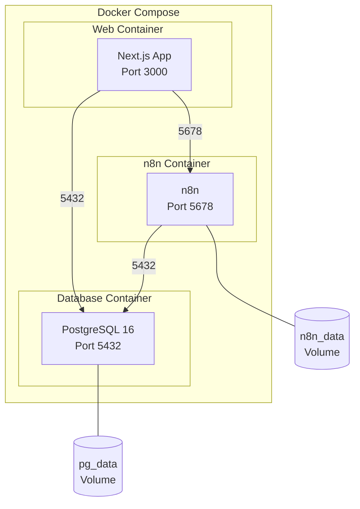

# 架構與設計文件 - n8n 個人品牌內容分發平台

> **版本:** v1.0 | **更新:** 2026-03-17 | **狀態:** 草稿

---

## 第 1 部分：架構總覽

### 1.1 C4 模型

**L1 系統情境圖**



**L2 容器圖**



**L3 元件圖（Backend API 內部）**



### 1.2 DDD 戰略設計

**通用語言（Ubiquitous Language）**

| 術語 | 定義 |
| :--- | :--- |
| **貼文 (Content)** | 使用者建立的一筆內容，包含標題、母文案、圖片、目標平台與排程時間 |
| **母文案 (Master Caption)** | 貼文的主要文案，可自動或手動轉換為各平台專屬版本 |
| **平台專屬文案** | 針對特定平台覆寫的文案（fb_caption, x_caption 等） |
| **目標平台 (Platforms)** | 貼文要發佈到的社群平台清單 |
| **排程 (Schedule)** | 設定貼文的預定發佈時間 |
| **發佈 (Publish)** | 透過 n8n 工作流將內容送至各平台 API 的過程 |
| **Adapter** | 負責特定平台格式轉換與 API 呼叫的模組 |
| **補發 (Retry/Resend)** | 對失敗的平台重新執行發佈 |
| **監控 (Monitor)** | 定時從各平台抓取已發佈貼文的互動數據 |
| **互動數據 (Engagement)** | 按讚、留言、分享等平台互動指標 |
| **發佈紀錄 (Publish Log)** | 每次平台發佈的詳細執行紀錄 |

**限界上下文（Bounded Contexts）**



### 1.3 分層架構

| 層級 | 職責 | 包含內容 |
| :--- | :--- | :--- |
| **Domain Layer** | 核心業務規則 | Content Entity、PublishLog Entity、MonitorData Entity、狀態機轉換規則、平台文案轉換邏輯 |
| **Application Layer** | 應用程式邏輯 | ContentService、ScheduleService、PublishService、MonitorService |
| **Infrastructure Layer** | 外部互動實現 | PostgreSQL Repository、n8n Webhook Client、平台 API Adapter |
| **Presentation Layer** | 使用者介面 | Next.js Pages、React Components（編輯器、儀表板） |

### 1.4 技術選型

| 分類 | 選用技術 | 選擇理由 | 備選方案 | ADR |
| :--- | :--- | :--- | :--- | :--- |
| 前端框架 | Next.js 14 (App Router) | SSR/SSG 支援、React 生態系、API Routes 整合 | Nuxt.js, Remix | - |
| UI 元件庫 | shadcn/ui + Tailwind CSS | 可客製化、輕量、現代化 UI | Ant Design, MUI | - |
| 後端框架 | Next.js API Routes | 前後端同框架、部署簡化 | Express.js, Fastify | - |
| 資料庫 | PostgreSQL | 穩定可靠、JSON 支援、擴展性佳 | SQLite（單人場景可降級） | Q-002 |
| ORM | Prisma | 型別安全、Migration 支援、開發體驗佳 | Drizzle, TypeORM | - |
| 自動化引擎 | n8n (self-hosted) | 視覺化工作流、豐富社群節點、Webhook 支援 | Temporal, n8n Cloud | Q-003 |
| 即時更新 | Server-Sent Events (SSE) | 單向推送足夠、實作簡單 | WebSocket, Polling | - |
| 容器化 | Docker + Docker Compose | 本地開發與部署一致性 | 直接安裝 | - |
| CI/CD | GitHub Actions | 與 GitHub 整合、免費額度 | GitLab CI | - |
| 可觀測性 | n8n Execution Logs + 應用日誌 | 利用 n8n 內建日誌 + 結構化應用日誌 | Grafana + Loki | - |

---

## 第 2 部分：需求摘要

### 功能性需求

| 編號 | 功能 | 對應 User Story |
| :--- | :--- | :--- |
| FR-01 | Web 貼文 CRUD（標題、母文案、圖片、平台選擇） | US-001 |
| FR-02 | 平台專屬文案覆寫與自動轉換 | US-003 |
| FR-03 | 排程發佈（立即/定時） | US-002 |
| FR-04 | n8n 多平台分發（FB、X、LINE，後續 IG） | US-002, US-003 |
| FR-05 | 發佈結果即時回報與狀態追蹤 | US-004 |
| FR-06 | 失敗平台單獨補發 | US-005 |
| FR-07 | 監控儀表板（發佈狀態總覽） | US-006 |
| FR-08 | 各平台互動數據抓取與顯示 | US-007 |
| FR-09 | 各平台回覆內容集中查看 | US-008 |
| FR-10 | 互動異常告警通知 | US-009 |

### 非功能性需求

| 分類 | 需求描述 | 目標值 |
| :--- | :--- | :--- |
| 性能 | 頁面載入時間 | < 2s |
| 性能 | API 回應時間 | < 500ms |
| 可維護性 | 各平台 Adapter 獨立 | 新增平台不影響既有邏輯 |
| 可觀測性 | 每次發佈可追查完整紀錄 | 100% 紀錄覆蓋 |
| 安全性 | API Token 管理 | 儲存於 n8n Credentials，不硬編碼 |
| 安全性 | 用戶認證 | 基本認證（MVP 可簡化） |
| 可擴展性 | 平台擴展 | 保留 LinkedIn、Telegram、Email 空間 |

---

## 第 3 部分：系統設計

### 3.1 架構模式

- **模式**: 模組化單體（Modular Monolith）+ 外部工作流引擎（n8n）
- **選擇理由**: 個人專案規模不需微服務的複雜度。Web App 與 API 使用 Next.js 單體部署，簡化維運。n8n 作為獨立的自動化引擎負責平台整合與監控，透過 Webhook 與主系統通訊，實現關注點分離。

### 3.2 系統元件圖



### 3.3 元件職責

| 元件 | 核心職責 | 技術 | 依賴 |
| :--- | :--- | :--- | :--- |
| Web Pages | 貼文編輯器 UI、監控儀表板 UI | Next.js App Router, React, shadcn/ui | API Routes |
| API Routes | 內容 CRUD、排程管理、接收 n8n 回報、SSE 推送 | Next.js API Routes, Prisma | PostgreSQL, n8n |
| PostgreSQL | 持久化貼文、發佈紀錄、監控數據 | PostgreSQL 16 | - |
| n8n 發佈工作流 | Webhook 觸發、資料標準化、平台路由、結果回報 | n8n (self-hosted) | 各平台 API |
| n8n 監控工作流 | 定時觸發、抓取互動數據、回寫資料庫 | n8n (self-hosted) | 各平台 API, PostgreSQL |
| FB Adapter | Facebook Page 發文、互動數據抓取 | n8n HTTP Request / FB Node | Facebook Graph API |
| X Adapter | X 發文、互動數據抓取 | n8n X Node / HTTP Request | X API v2 |
| LINE Adapter | LINE 訊息推送 | n8n LINE Node / HTTP Request | LINE Messaging API |
| IG Adapter | Instagram 發文（Phase 5） | n8n HTTP Request | Instagram Graph API |

### 3.4 關鍵使用者旅程

**場景 1: 建立貼文並排程發佈**

對應 BDD: `content_management.feature` → 成功建立一篇新貼文、`scheduled_publishing.feature` → 設定排程時間後自動發佈

```
使用者開啟編輯器
  → 輸入標題、母文案、上傳圖片
  → 選擇目標平台 (fb, x, line)
  → (可選) 覆寫平台專屬文案
  → 設定排程時間 2026-03-20 09:00
  → 確認排程
  → API 儲存至 content_queue (status=queued)
  → 排程時間到達
  → 後端觸發 n8n Webhook
  → n8n 讀取資料、標準化文案
  → Switch/Router 依 platforms 分流
  → FB Adapter → Facebook Graph API → 取得 post_id
  → X Adapter → X API → 取得 tweet_id
  → LINE Adapter → LINE API → 取得送達狀態
  → n8n Webhook 回報結果至後端
  → 更新 content_queue (status=success)
  → 寫入 publish_logs (每平台一筆)
  → SSE 推送狀態更新至瀏覽器
```

**場景 2: 部分平台失敗後補發**

對應 BDD: `multi_platform_distribution.feature` → 部分平台發佈失敗、單一平台手動補發

```
n8n 發佈工作流執行
  → FB 回傳 401 Token 過期
  → X 發佈成功 (tweet_id=xxx)
  → LINE 推送成功
  → 回報結果至後端
  → 更新 content_queue (status=partial_success)
  → publish_logs 記錄 FB failed + 錯誤原因
  → 管理者在儀表板看到 partial_success
  → 管理者更新 FB Token
  → 管理者點擊「補發 Facebook」
  → API 觸發 n8n Webhook (僅 FB)
  → FB Adapter 重新發佈成功
  → 更新 content_queue (status=success)
```

**場景 3: 監控互動數據**

對應 BDD: `monitoring_dashboard.feature` → 查看各平台互動數據

```
n8n 監控工作流 (每 30 分鐘觸發)
  → 從 DB 讀取 status=success 且有 external_post_id 的貼文
  → 對每篇貼文的每個平台:
    → FB Adapter → GET /{post_id}?fields=likes,comments,shares
    → X Adapter → GET /tweets/{id}?tweet.fields=public_metrics
    → LINE (無互動 API，跳過)
  → 寫入 monitor_data 表
  → 使用者開啟監控儀表板
  → API 查詢 monitor_data
  → 顯示各平台按讚/留言/分享數據
  → 顯示最新回覆內容列表
```

---

## 第 4 部分：資料架構

### 資料模型 (ER 圖)



### Prisma Schema 設計

```prisma
model ContentQueue {
  id             String   @id @default(uuid())
  title          String
  masterCaption  String   @map("master_caption")
  imageUrl       String?  @map("image_url")
  platforms      String   // "fb,x,line"
  publishAt      DateTime? @map("publish_at")
  status         String   @default("draft")
  fbCaption      String?  @map("fb_caption")
  igCaption      String?  @map("ig_caption")
  xCaption       String?  @map("x_caption")
  lineMessage    String?  @map("line_message")
  retryCount     Int      @default(0) @map("retry_count")
  lastError      String?  @map("last_error")
  createdAt      DateTime @default(now()) @map("created_at")
  updatedAt      DateTime @updatedAt @map("updated_at")

  publishLogs    PublishLog[]
  monitorData    MonitorData[]

  @@map("content_queue")
}

model PublishLog {
  logId               String   @id @default(uuid()) @map("log_id")
  contentId           String   @map("content_id")
  platform            String
  status              String
  externalPostId      String?  @map("external_post_id")
  responseSummary     String?  @map("response_summary")
  workflowExecutionId String?  @map("workflow_execution_id")
  createdAt           DateTime @default(now()) @map("created_at")

  content             ContentQueue @relation(fields: [contentId], references: [id])

  @@map("publish_logs")
}

model MonitorData {
  id              String   @id @default(uuid())
  contentId       String   @map("content_id")
  platform        String
  externalPostId  String   @map("external_post_id")
  likes           Int      @default(0)
  comments        Int      @default(0)
  shares          Int      @default(0)
  recentReplies   Json?    @map("recent_replies")
  fetchedAt       DateTime @default(now()) @map("fetched_at")

  content         ContentQueue @relation(fields: [contentId], references: [id])

  @@map("monitor_data")
}
```

### 一致性策略

| 場景 | 策略 | 說明 |
| :--- | :--- | :--- |
| 貼文 CRUD | 強一致 | 直接寫入 PostgreSQL，立即可見 |
| 發佈結果回寫 | 最終一致 | n8n 透過 Webhook 回報，可能有數秒延遲 |
| 監控數據 | 最終一致 | 每 30 分鐘批次抓取，非即時 |

### 資料分類與合規

| 資料類型 | 敏感等級 | 處理方式 |
| :--- | :--- | :--- |
| 貼文內容 | 低 | 一般儲存 |
| 平台 API Token | 高 | 儲存於 n8n Credentials，不進資料庫 |
| 使用者密碼（若有認證） | 高 | bcrypt 雜湊儲存 |
| 平台回覆內容 | 中 | JSON 儲存，定期清理舊資料 |

---

## 第 5 部分：部署與基礎設施

### 部署視圖



### Docker Compose 服務定義

| 服務 | Image | Port | Volume | 依賴 |
| :--- | :--- | :--- | :--- | :--- |
| web | node:20-alpine (build) | 3000 | - | db, n8n |
| db | postgres:16-alpine | 5432 | pg_data | - |
| n8n | n8nio/n8n:latest | 5678 | n8n_data | db |

### CI/CD 流程

```
git push
  → GitHub Actions trigger
  → Lint (ESLint) + Type Check (tsc)
  → Unit Tests (Vitest)
  → Integration Tests (Vitest + Testcontainers)
  → Build (next build)
  → Docker Build & Push
  → Deploy (docker compose up -d)
```

### 環境策略

| 環境 | 用途 | 資料庫 | n8n |
| :--- | :--- | :--- | :--- |
| Development | 本地開發 | SQLite / PostgreSQL (Docker) | n8n (Docker) |
| Production | 正式環境 | PostgreSQL (Docker) | n8n (Docker) |

### 成本估算

| 項目 | 方案 | 估計成本 |
| :--- | :--- | :--- |
| 伺服器 | VPS (2 vCPU, 4GB RAM) | ~$10-20/月 |
| 資料庫 | PostgreSQL (同 VPS) | 含在伺服器 |
| n8n | Self-hosted (同 VPS) | 含在伺服器 |
| 網域 + SSL | Cloudflare (免費方案) | $0 |
| **合計** | | **~$10-20/月** |

---

## 第 6 部分：跨領域考量

### 可觀測性

| 面向 | 方案 | 說明 |
| :--- | :--- | :--- |
| **日誌** | 結構化 JSON 日誌 (pino) | 後端 API 所有請求/回應記錄，含 request_id |
| **n8n 執行紀錄** | n8n 內建 Execution Log | 每次工作流執行的完整紀錄，可透過 execution_id 追查 |
| **指標** | publish_logs + monitor_data | 發佈成功率、各平台互動趨勢，從資料庫查詢 |
| **告警** | n8n → Email / LINE Notify | 發佈失敗、Token 過期、互動異常時通知 |

### 安全性

| 面向 | 策略 |
| :--- | :--- |
| **認證** | MVP: 基本 HTTP Auth 或環境變數密碼；後續可升級 NextAuth.js |
| **API Token 管理** | 所有平台 Token 存於 n8n Credentials，不進原始碼或資料庫 |
| **輸入驗證** | 使用 Zod schema 驗證所有 API 輸入 |
| **SQL 注入防護** | Prisma ORM 參數化查詢 |
| **XSS 防護** | React 預設 escape + 富文本編輯器輸出清理 |
| **HTTPS** | Cloudflare 或 Nginx reverse proxy 提供 TLS |
| **n8n Webhook 驗證** | Webhook URL 含隨機 token 或 HMAC 簽名驗證 |

---

## 第 7 部分：風險與演進

### 風險

| 風險 | 可能性 | 影響 | 緩解策略 |
| :--- | :--- | :--- | :--- |
| 平台 API 變更或廢棄 | 中 | 高 | Adapter 隔離，變更僅影響單一模組 |
| Token 過期導致發佈中斷 | 高 | 中 | n8n 失敗告警 + Token 到期前提醒 |
| n8n 服務當機 | 低 | 高 | Docker restart policy + 健康檢查 |
| 平台 Rate Limit | 中 | 中 | n8n 分批處理 + 指數退避重試 |
| 排程時區錯位 | 中 | 中 | 統一使用 Asia/Taipei，publish_at 含時區資訊 |
| 資料庫資料遺失 | 低 | 高 | 定期備份 (pg_dump cron job) |
| 監控 API 配額耗盡 | 中 | 低 | 控制抓取頻率，按需調整 |

### 演進路線

| 階段 | 範圍與目標 | 預計時程 |
| :--- | :--- | :--- |
| **Phase 1 (基礎架構)** | Next.js 專案骨架 + PostgreSQL + Prisma + n8n Docker 環境 + 基本 API 骨架 | 5-7 天 |
| **Phase 2 (最小閉環)** | Web 貼文編輯器 + 排程設定 + n8n X Adapter + 狀態回寫 + 基本儀表板 | 3-5 天 |
| **Phase 3 (多平台)** | Facebook Adapter + LINE Adapter + 平台路由 + 補發機制 | 3-5 天 |
| **Phase 4 (監控)** | n8n 監控工作流 + 互動數據抓取 + 監控儀表板 + 回覆彙整 | 5-7 天 |
| **Phase 5 (完善)** | Instagram Adapter + 告警通知 + UI 優化 + 測試補齊 + 文件整理 | 5-7 天 |

---

## 第 8 部分：模組詳細設計

### MVP 範圍

- **關鍵模組**: 貼文管理模組、排程發佈模組、n8n 發佈工作流、發佈狀態追蹤模組
- **後續模組**: 監控儀表板模組、互動告警模組、Instagram Adapter

### 模組: 貼文管理 (Content Management)

- **對應 BDD**: `content_management.feature`, `platform_caption.feature`
- **職責**: 貼文的建立、編輯、刪除、列表查詢；平台專屬文案管理
- **API 設計**:

| Method | Path | 說明 |
| :--- | :--- | :--- |
| GET | /api/contents | 取得貼文列表（支援分頁、狀態篩選） |
| GET | /api/contents/:id | 取得單筆貼文詳情 |
| POST | /api/contents | 建立新貼文 |
| PUT | /api/contents/:id | 更新貼文 |
| DELETE | /api/contents/:id | 刪除草稿貼文（僅 draft 狀態可刪） |

- **關鍵邏輯**:

```
建立貼文:
  驗證必填欄位 (title, master_caption)
  驗證平台專屬文案字數限制 (x_caption <= 280)
  儲存至 content_queue (status = "draft")
  回傳新建貼文

刪除貼文:
  檢查 status，若非 "draft" 則拒絕
  刪除相關 publish_logs 與 monitor_data
  刪除 content_queue 記錄
```

### 模組: 排程發佈 (Publishing & Scheduling)

- **對應 BDD**: `scheduled_publishing.feature`, `multi_platform_distribution.feature`, `status_transitions.feature`
- **職責**: 排程管理、觸發 n8n 工作流、接收發佈結果、狀態機轉換
- **API 設計**:

| Method | Path | 說明 |
| :--- | :--- | :--- |
| POST | /api/contents/:id/schedule | 設定排程（含 publish_at） |
| POST | /api/contents/:id/publish | 立即發佈 |
| POST | /api/contents/:id/retry | 補發失敗平台 |
| DELETE | /api/contents/:id/schedule | 取消排程 |
| POST | /api/webhooks/n8n/publish-result | 接收 n8n 發佈結果回報 |

- **關鍵邏輯**:

```
設定排程:
  驗證 publish_at 為未來時間
  驗證 platforms 至少選擇一個
  更新 status: draft → queued
  (排程觸發可由後端 cron 或 n8n Schedule Trigger 處理)

接收發佈結果 (Webhook):
  解析 n8n 回報的各平台結果
  寫入 publish_logs (每平台一筆)
  計算整體狀態:
    全部 success → status = "success"
    部分 success → status = "partial_success"
    全部 failed → status = "failed", retry_count += 1
  透過 SSE 推送狀態更新

補發:
  檢查 status 為 partial_success 或 failed
  篩選出失敗的平台
  觸發 n8n Webhook (僅含失敗平台)
  已有 success + external_post_id 的平台跳過
```

### 模組: n8n 發佈工作流 (Publish Workflow)

- **對應 BDD**: `multi_platform_distribution.feature`, `error_handling.feature`
- **職責**: 接收 Webhook 觸發、資料標準化、平台路由、各 Adapter 呼叫、結果回報

```
n8n 工作流節點設計:

01. Webhook Trigger        ← 接收後端 API 觸發
02. Validate Input         ← 驗證必要欄位
03. Normalize Content      ← 標準化母文案與平台欄位
04. Switch (platforms)     ← 依 platforms 欄位分流
05a. FB Adapter            ← POST /{page_id}/feed
05b. X Adapter             ← POST /2/tweets
05c. LINE Adapter          ← POST /v2/bot/message/push
05d. IG Adapter            ← POST /{ig_user_id}/media + /media_publish
06. Merge Results          ← 整合各平台回傳
07. Webhook Response       ← POST /api/webhooks/n8n/publish-result

錯誤處理:
  每個 Adapter 包裹 try-catch
  4xx → 記錄錯誤，不重試
  5xx / timeout → retry (max 3, exponential backoff)
  單一 Adapter 失敗不阻斷其他
```

### 模組: 監控儀表板 (Monitoring Dashboard)

- **對應 BDD**: `monitoring_dashboard.feature`, `interaction_alerts.feature`
- **職責**: 顯示發佈狀態總覽、各平台互動數據、回覆內容彙整
- **API 設計**:

| Method | Path | 說明 |
| :--- | :--- | :--- |
| GET | /api/dashboard/overview | 發佈狀態統計（各狀態數量） |
| GET | /api/dashboard/contents | 已發佈貼文列表（含最新互動數據） |
| GET | /api/dashboard/contents/:id/engagement | 特定貼文的互動數據歷史 |
| GET | /api/dashboard/contents/:id/replies | 特定貼文的回覆內容 |
| GET | /api/contents/:id/logs | 特定貼文的發佈紀錄 |

- **關鍵邏輯**:

```
互動數據查詢:
  JOIN content_queue + monitor_data
  GROUP BY platform
  取各平台最新一筆 fetched_at 的數據
  回傳 { fb: {likes, comments, shares}, x: {...}, ... }

回覆內容彙整:
  從 monitor_data.recent_replies (JSON) 讀取
  合併各平台回覆
  依時間排序 (最新在前)
  標示來源平台
```

### 模組: n8n 監控工作流 (Monitor Workflow)

- **對應 BDD**: `monitoring_dashboard.feature`
- **職責**: 定時抓取各平台互動數據與回覆，寫入 monitor_data

```
n8n 監控工作流節點設計:

01. Schedule Trigger       ← 每 30 分鐘觸發
02. DB Query               ← 讀取 status=success 且有 external_post_id 的貼文
03. Split in Batches       ← 逐筆處理
04. Switch (platform)      ← 依平台分流
05a. FB: GET /{post_id}?fields=likes.summary(true),comments{message,from},shares
05b. X: GET /2/tweets/{id}?tweet.fields=public_metrics&expansions=...
05c. IG: GET /{post_id}?fields=like_count,comments_count,comments{text,from}
06. Transform Data         ← 轉換為 monitor_data 格式
07. DB Upsert              ← 寫入 monitor_data (同 content_id + platform 更新)

告警檢查:
  貼文發佈超過 24h 且所有平台互動 = 0 → 發送零互動告警
  同一告警不重複發送 (檢查上次告警時間)
```

### NFR 實現

| 面向 | 策略 |
| :--- | :--- |
| **性能** | Next.js SSR/SSG 加速首頁載入；API Routes 直接存取 DB 無額外網路跳轉；監控數據查詢加 DB index (content_id, platform, fetched_at) |
| **安全** | Zod 輸入驗證；Prisma 參數化查詢；n8n Webhook HMAC 簽名；API Token 不進原始碼 |
| **可擴展** | Adapter 模式隔離平台邏輯；新增平台僅需：(1) 新增 n8n Adapter 節點 (2) platforms 欄位加值 (3) 可選：新增平台專屬文案欄位 |
| **可觀測** | publish_logs 100% 記錄；n8n execution log 可追查；結構化日誌含 content_id 便於關聯查詢 |
