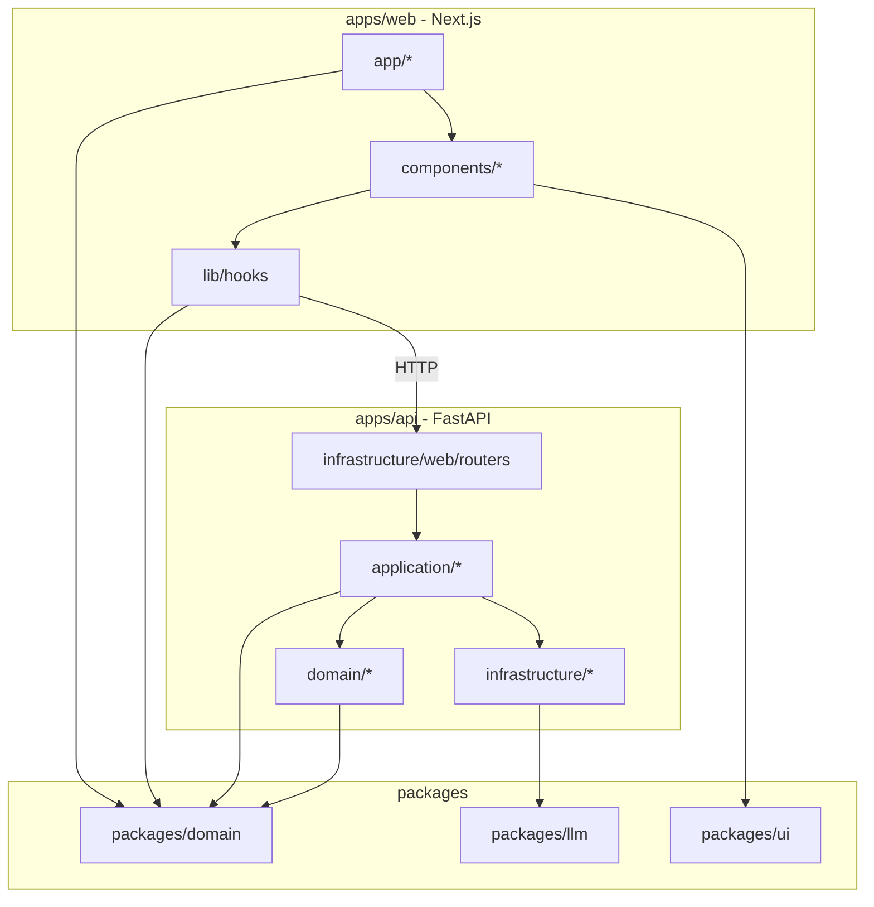
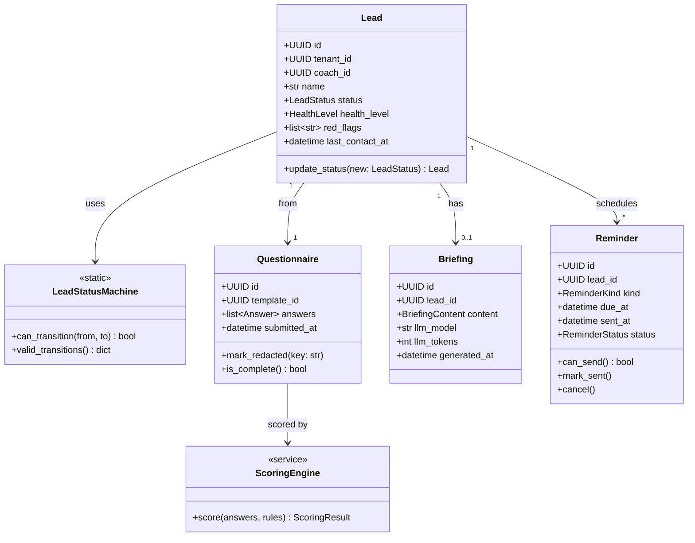

# 設計與依賴關係 — Synergy AI Closer's Copilot

> **版本:** v1.0 | **更新:** 2026-04-24
> **對應架構：** `docs/04_architecture.md` | **對應結構：** `docs/07_structure.md`

---

## 1. 分層與依賴方向



**規則**：
- Domain 不依賴任何其他層（純粹業務）
- Application 只依賴 Domain 與抽象介面（不直接 import 具體 Infra）
- Infrastructure 實作 Application 定義的介面
- `packages/*` 是橫切，所有層可用

---

## 2. 核心類別圖（Domain）



---

## 3. 技術依賴清單

### 3.1 前端（`apps/web`）

| 套件 | 版本 | 用途 | 理由 |
| :--- | :--- | :--- | :--- |
| next | ^15.0 | SSR/SSG 框架 | 既有 module2 技術棧 |
| react | ^19.0 | UI | — |
| typescript | ^5.5 | 型別 | — |
| tailwindcss | ^4.0 | CSS | 既有 Apple tokens |
| @tanstack/react-query | ^5 | API 狀態管理 | 快取 + 重打 + optimistic update |
| @supabase/supabase-js | ^2 | Auth + Realtime | ADR-003 |
| zod | ^3 | schema 驗證 | 與 Pydantic 概念一致 |
| @hookform/resolvers | ^3 | 表單 | 問卷複雜表單 |
| react-hook-form | ^7 | 表單狀態 | — |
| lucide-react | latest | Icon | 輕量 |
| date-fns | ^3 | 時間 | 比 moment 輕 |

### 3.2 後端（`apps/api`）

| 套件 | 版本 | 用途 | 理由 |
| :--- | :--- | :--- | :--- |
| fastapi | ^0.115 | REST API | — |
| uvicorn | ^0.30 | ASGI server | — |
| pydantic | ^2.9 | 資料驗證 | Pydantic v2 更快 |
| pydantic-settings | ^2 | 配置 | 環境變數管理 |
| supabase | ^2 | Client | ADR-003 |
| litellm | ^1.50 | LLM 抽象 | ADR-004 |
| line-bot-sdk | ^3 | LINE Messaging API（主通道）| ADR-008 |
| resend | ^2 | Email（備援通道）| ADR-008 |
| apscheduler | ^3.10 | 排程 | 單機夠用 |
| structlog | ^24 | 結構化日誌 | JSON 輸出 |
| httpx | ^0.27 | HTTP client | async |
| sentry-sdk | ^2 | 錯誤追蹤 | — |
| python-jose | ^3 | JWT 解碼 | Supabase JWT |
| pyyaml | ^6 | 計分規則 YAML | — |

### 3.3 開發依賴

| 套件 | 用途 |
| :--- | :--- |
| pytest、pytest-asyncio、pytest-bdd、pytest-cov | 測試 |
| ruff | Lint + format |
| mypy | 型別檢查 |
| vcr.py | 錄製 HTTP 回應（LLM 測試） |
| playwright | E2E |
| eslint、prettier | TS lint |
| @testing-library/react | 元件測試 |

### 3.4 LLM 供應商

| 供應商 | 模型 | 用途 | 月成本估（Pilot） |
| :--- | :--- | :--- | :--- |
| Google | gemini-2.5-flash（預設） | 問卷摘要 + 商談摘要 | 50-200 NTD |
| Anthropic | claude-haiku-4-5（備援） | 成本超標時降級 | — |
| Anthropic | claude-opus-4-6（品質備援） | Pilot 若品質不足切換 | 500+ NTD |

---

## 4. SOLID 檢核

| 原則 | 檢核 | 實踐位置 |
| :--- | :--- | :--- |
| **S** 單一職責 | 每個 Service 一個 Bounded Context | `apps/api/src/application/*` 各一檔 |
| **O** 開放封閉 | LLM / Channel 抽象可擴充 | `LLMAdapter`、`NotificationChannel` Protocol |
| **L** 里氏替換 | LiteLLMAdapter、ResendEmailChannel 可被測試替身取代 | 測試 fixture |
| **I** 介面隔離 | Adapter 介面只暴露必要方法 | `LLMAdapter.complete()` 單一方法 |
| **D** 依賴反轉 | Application 依賴介面，不直接 import Resend SDK | `ReminderService` 收 `NotificationChannel` |

---

## 5. 設計模式清單

| 模式 | 使用處 | 目的 |
| :--- | :--- | :--- |
| **Repository** | `infrastructure/persistence/repositories/*` | 封裝 Supabase 存取 |
| **Adapter** | `LLMAdapter`、`NotificationChannel` | 抽象外部服務 |
| **State Machine** | `LeadStatusMachine` | Lead 狀態轉換規則 |
| **Strategy** | 計分規則 YAML + `ScoringEngine` | 規則可版本替換 |
| **Idempotency Key** | `POST /submit`、`regenerate` | 避免重複副作用 |
| **Background Task** | Briefing 生成、Reminder 發送 | 非阻塞主請求 |
| **Circuit Breaker** | LLM 呼叫（Phase 2） | 故障隔離 |

---

## 6. 版本相容性策略

### Python
- Python 3.12（`.python-version` 鎖定）
- `uv` 管理，`uv.lock` 提交
- 相依套件升級：每月一次 `uv sync --upgrade` + CI 綠燈後合併

### Node
- Node 20 LTS
- `pnpm@9`（由 `packageManager` 鎖定）
- TypeScript strict mode

### API 版本
- URL path 版本（`/v1`）
- Phase 2 新功能走 `/v1` 累加；若破壞性變更新開 `/v2`

---

## 7. 關鍵依賴風險與備援

| 依賴 | 風險 | 備援 |
| :--- | :--- | :--- |
| Gemini API | 服務中斷、漲價、模型下架 | LiteLLM 一行切 Claude Haiku 或 GPT-4o mini |
| Supabase | 服務中斷、免費額度調整 | Migration 可匯出 PG dump；備用 Neon / Railway Postgres |
| LINE Messaging API | 服務中斷、帳號被 block、用量超額 | 自動降級走 Resend Email（同請求內 fallback）|
| Resend | 寄信失敗 | retry 3 次；本就是 LINE 的備援 |
| Vercel (Web) | 部署限額 | 前端可搬 Cloudflare Pages（Next.js 支援） |
| Railway (API) | 成本上升 | 搬 Fly.io 或自架 VM |

**備援原則**：每個 SaaS 依賴都應有「搬家計畫」文件（< 1 天可完成的切換步驟）。

---

## 8. 資料流向（Sequence 摘要）

參見 `docs/04_architecture.md §3.4` 兩個主要序列圖（填問卷、狀態變更）。本處不重複。

---

## 9. Prompt 工程依賴

### Prompt 版本化

```
packages/llm/src/synergy_llm/prompts/
├── briefing_v1.py       # 商談摘要（MVP）
├── briefing_v2.py       # 未來迭代
├── public_summary_v1.py # 問卷填答者摘要
└── _helpers.py          # 共用清洗、範本
```

- 每次改 prompt bump version
- `briefings.llm_prompt_version` 欄位記錄使用版本
- A/B 測試時可同時啟用多版本（flag 控制）

### Prompt 輸出契約

所有 LLM 呼叫**必須**使用 JSON mode + Pydantic 驗證。無驗證的自由文字輸出**不允許**進 DB。

---

## 10. 設定與 Feature Flag

### 環境變數（`.env.example`）

```bash
# Supabase
SUPABASE_URL=
SUPABASE_ANON_KEY=
SUPABASE_SERVICE_ROLE_KEY=

# LLM
LLM_PROVIDER=gemini
GEMINI_API_KEY=
# ANTHROPIC_API_KEY= (備援)

# Notifications — LINE 主通道
LINE_CHANNEL_SECRET=
LINE_CHANNEL_ACCESS_TOKEN=
LINE_OA_FRIEND_URL=https://line.me/R/ti/p/@synergy-ai

# Notifications — Email 備援
RESEND_API_KEY=
RESEND_FROM_EMAIL=noreply@synergy-ai.tw

# App
APP_ENV=development  # development / staging / production
TENANT_DEFAULT=synergy
NOTIFICATION_PRIMARY_CHANNEL=line  # line / email
NOTIFICATION_FALLBACK_ENABLED=true
FEATURE_MULTI_TENANT_UI=false

# Rate limit
RATE_LIMIT_ANONYMOUS=10/minute
RATE_LIMIT_AUTHENTICATED=60/minute
```

### Feature Flag（code 內用 `settings.feature_xxx`）

| Flag | 預設 | 啟用時機 |
| :--- | :--- | :--- |
| `NOTIFICATION_PRIMARY_CHANNEL` | line | contingency：LINE 未過審核時切 `email` |
| `NOTIFICATION_FALLBACK_ENABLED` | true | 預設啟用 fallback；除錯時可關閉 |
| `FEATURE_MULTI_TENANT_UI` | false | Phase 2 Gate 後 |
| `FEATURE_VOICE_BRIEFING` | false | Phase 3 |

Flag 不使用第三方服務（Pilot 量太小不值得），`.env` 管理即可。
