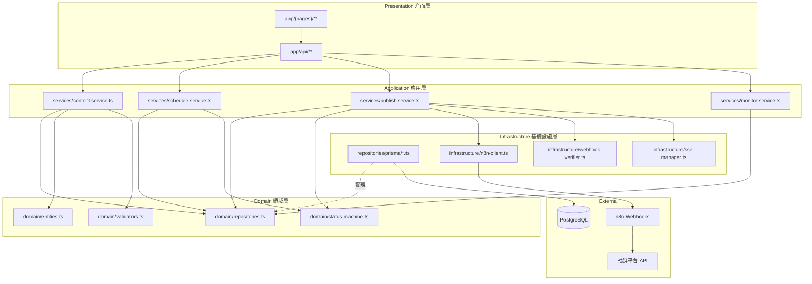

# 模組依賴關係分析 - n8n 個人品牌內容分發平台

> **版本:** v1.0 | **更新:** 2026-03-17 | **狀態:** 草稿

---

## 依賴原則

| 原則 | 要點 |
| :--- | :--- |
| **依賴倒置 (DIP)** | Service 層依賴 Repository 介面，不依賴 Prisma 實現細節 |
| **無循環依賴 (ADP)** | 依賴關係形成 DAG：API Routes → Services → Domain / Repositories |
| **穩定依賴 (SDP)** | Domain 層（Entity、介面）最穩定，Presentation 層最不穩定 |

---

## 架構分層依賴圖



**規則**: Pages → API Routes → Services → Domain（單向）。Infrastructure 實現 Domain 定義的介面。

---

## 層級職責

| 層級 | 職責 | 程式碼路徑 |
| :--- | :--- | :--- |
| Presentation - Pages | React 頁面元件、使用者互動 | `src/app/(pages)/` |
| Presentation - API | HTTP 處理、請求驗證、回應序列化 | `src/app/api/v1/` |
| Application | 編排業務流程、協調 Domain 與 Infrastructure | `src/services/` |
| Domain | 核心業務邏輯、實體定義、介面契約、狀態機 | `src/domain/` |
| Infrastructure | DB 存取、n8n 通信、Webhook 驗證、SSE 管理 | `src/repositories/`, `src/infrastructure/` |
| Shared | 型別定義、工具函式、常數、Zod Schema | `src/lib/` |

---

## 詳細檔案結構與依賴

```
src/
├── app/
│   ├── (pages)/                          # Presentation - Pages
│   │   ├── editor/
│   │   │   └── page.tsx                  # 貼文編輯器頁面
│   │   │       → components/content-form.tsx
│   │   │       → components/platform-preview.tsx
│   │   ├── dashboard/
│   │   │   └── page.tsx                  # 監控儀表板頁面
│   │   │       → components/status-overview.tsx
│   │   │       → components/engagement-table.tsx
│   │   │       → components/replies-list.tsx
│   │   └── layout.tsx
│   │       → components/ui/* (shadcn)
│   │
│   └── api/v1/                           # Presentation - API Routes
│       ├── contents/
│       │   ├── route.ts                  # GET /contents, POST /contents
│       │   │   → services/content.service.ts
│       │   │   → lib/schemas/content.schema.ts
│       │   └── [id]/
│       │       ├── route.ts              # GET/PUT/DELETE /contents/:id
│       │       │   → services/content.service.ts
│       │       ├── schedule/
│       │       │   └── route.ts          # POST/DELETE /contents/:id/schedule
│       │       │       → services/schedule.service.ts
│       │       ├── publish/
│       │       │   └── route.ts          # POST /contents/:id/publish
│       │       │       → services/publish.service.ts
│       │       ├── retry/
│       │       │   └── route.ts          # POST /contents/:id/retry
│       │       │       → services/publish.service.ts
│       │       └── logs/
│       │           └── route.ts          # GET /contents/:id/logs
│       │               → services/publish.service.ts
│       ├── webhooks/
│       │   └── n8n/
│       │       └── publish-result/
│       │           └── route.ts          # POST /webhooks/n8n/publish-result
│       │               → services/publish.service.ts
│       │               → infrastructure/webhook-verifier.ts
│       ├── dashboard/
│       │   ├── overview/
│       │   │   └── route.ts              # GET /dashboard/overview
│       │   │       → services/monitor.service.ts
│       │   └── contents/
│       │       ├── route.ts              # GET /dashboard/contents
│       │       │   → services/monitor.service.ts
│       │       └── [id]/
│       │           ├── engagement/
│       │           │   └── route.ts      # GET /dashboard/contents/:id/engagement
│       │           │       → services/monitor.service.ts
│       │           └── replies/
│       │               └── route.ts      # GET /dashboard/contents/:id/replies
│       │                   → services/monitor.service.ts
│       └── sse/
│           ├── contents/[id]/status/
│           │   └── route.ts              # GET /sse/contents/:id/status
│           │       → infrastructure/sse-manager.ts
│           └── dashboard/
│               └── route.ts              # GET /sse/dashboard
│                   → infrastructure/sse-manager.ts
│
├── services/                             # Application 應用層
│   ├── content.service.ts
│   │   → domain/repositories.ts (ContentRepository)
│   │   → domain/entities.ts (Content)
│   │   → domain/validators.ts
│   │   → lib/schemas/content.schema.ts
│   ├── schedule.service.ts
│   │   → domain/repositories.ts (ContentRepository)
│   │   → domain/status-machine.ts
│   ├── publish.service.ts
│   │   → domain/repositories.ts (ContentRepository, PublishLogRepository)
│   │   → domain/status-machine.ts
│   │   → infrastructure/n8n-client.ts
│   │   → infrastructure/webhook-verifier.ts
│   │   → infrastructure/sse-manager.ts
│   └── monitor.service.ts
│       → domain/repositories.ts (MonitorDataRepository, ContentRepository)
│
├── domain/                               # Domain 領域層
│   ├── entities.ts                       # Content, PublishLog, MonitorData 型別
│   │   → (無外部依賴)
│   ├── repositories.ts                   # Repository 介面定義
│   │   → domain/entities.ts
│   ├── status-machine.ts                 # 狀態轉換規則
│   │   → (無外部依賴)
│   └── validators.ts                     # 業務驗證規則
│       → domain/entities.ts
│
├── repositories/                         # Infrastructure - 資料存取
│   └── prisma/
│       ├── content.repository.ts         # ContentRepository 實現
│       │   → domain/repositories.ts (implements)
│       │   → lib/prisma.ts
│       ├── publish-log.repository.ts     # PublishLogRepository 實現
│       │   → domain/repositories.ts (implements)
│       │   → lib/prisma.ts
│       └── monitor-data.repository.ts    # MonitorDataRepository 實現
│           → domain/repositories.ts (implements)
│           → lib/prisma.ts
│
├── infrastructure/                       # Infrastructure - 外部服務
│   ├── n8n-client.ts                     # n8n Webhook 呼叫
│   │   → lib/config.ts (N8N_WEBHOOK_URL)
│   ├── webhook-verifier.ts               # HMAC 簽名驗證
│   │   → lib/config.ts (WEBHOOK_SECRET)
│   └── sse-manager.ts                    # Server-Sent Events 管理
│       → (無外部依賴)
│
├── components/                           # UI 元件
│   ├── content-form.tsx                  # 貼文表單元件
│   │   → components/ui/* (shadcn)
│   │   → lib/schemas/content.schema.ts
│   ├── platform-preview.tsx              # 平台預覽元件
│   ├── status-overview.tsx               # 狀態統計卡片
│   ├── engagement-table.tsx              # 互動數據表格
│   ├── replies-list.tsx                  # 回覆列表元件
│   └── ui/                              # shadcn/ui 基礎元件
│       ├── button.tsx
│       ├── input.tsx
│       ├── card.tsx
│       ├── table.tsx
│       ├── badge.tsx
│       ├── select.tsx
│       └── ...
│
├── lib/                                  # Shared 共用層
│   ├── prisma.ts                         # Prisma Client 單例
│   ├── config.ts                         # 環境變數讀取
│   ├── errors.ts                         # 自定義錯誤類別
│   ├── api-response.ts                   # 統一回應格式 helper
│   └── schemas/
│       ├── content.schema.ts             # Zod: ContentCreate, ContentUpdate
│       ├── schedule.schema.ts            # Zod: ScheduleCreate
│       ├── publish.schema.ts             # Zod: RetryRequest, PublishResultPayload
│       └── query.schema.ts              # Zod: 分頁、篩選、排序參數
│
├── prisma/
│   ├── schema.prisma                     # Prisma Schema 定義
│   └── migrations/                       # 資料庫遷移
│
└── __tests__/                            # 測試
    ├── unit/
    │   ├── services/
    │   │   ├── content.service.test.ts
    │   │   ├── schedule.service.test.ts
    │   │   ├── publish.service.test.ts
    │   │   └── monitor.service.test.ts
    │   ├── domain/
    │   │   ├── status-machine.test.ts
    │   │   └── validators.test.ts
    │   └── infrastructure/
    │       └── webhook-verifier.test.ts
    ├── integration/
    │   ├── api/
    │   │   ├── contents.test.ts
    │   │   ├── schedule.test.ts
    │   │   ├── publish.test.ts
    │   │   └── dashboard.test.ts
    │   └── repositories/
    │       ├── content.repository.test.ts
    │       ├── publish-log.repository.test.ts
    │       └── monitor-data.repository.test.ts
    └── e2e/
        ├── publish-flow.test.ts
        └── dashboard.test.ts
```

---

## 關鍵依賴路徑

### 場景 1: 建立貼文

```
1. app/api/v1/contents/route.ts (POST)     → 接收 HTTP 請求
2. lib/schemas/content.schema.ts            → Zod 驗證輸入
3. services/content.service.ts              → 業務邏輯編排
4. domain/validators.ts                     → 業務規則驗證 (字數、平台)
5. domain/repositories.ts (ContentRepository) → 介面呼叫
6. repositories/prisma/content.repository.ts → Prisma 寫入 DB
7. lib/api-response.ts                      → 格式化回應
```

### 場景 2: n8n 發佈結果回報

```
1. app/api/v1/webhooks/n8n/publish-result/route.ts → 接收 Webhook
2. infrastructure/webhook-verifier.ts               → HMAC 簽名驗證
3. lib/schemas/publish.schema.ts                    → Zod 驗證 payload
4. services/publish.service.ts                      → 業務邏輯
5. domain/status-machine.ts                         → 計算新狀態
6. domain/repositories.ts (ContentRepo + LogRepo)   → 介面呼叫
7. repositories/prisma/content.repository.ts        → 更新 content status
8. repositories/prisma/publish-log.repository.ts    → 寫入 logs
9. infrastructure/sse-manager.ts                    → 推送狀態更新至前端
```

### 場景 3: 監控儀表板查詢互動數據

```
1. app/api/v1/dashboard/contents/[id]/engagement/route.ts → 接收請求
2. services/monitor.service.ts                             → 業務邏輯
3. domain/repositories.ts (MonitorDataRepository)          → 介面呼叫
4. repositories/prisma/monitor-data.repository.ts          → 查詢 DB
5. lib/api-response.ts                                     → 格式化回應
```

### 場景 4: 立即發佈觸發 n8n

```
1. app/api/v1/contents/[id]/publish/route.ts  → 接收請求
2. services/publish.service.ts                → 業務邏輯
3. domain/status-machine.ts                   → 驗證 draft/queued → publishing
4. domain/repositories.ts (ContentRepository) → 更新狀態
5. infrastructure/n8n-client.ts               → HTTP POST to n8n Webhook
6. lib/api-response.ts                        → 回傳 202 Accepted
```

---

## 依賴風險管理

| 風險 | 解決策略 |
| :--- | :--- |
| 循環依賴 | Service 之間不互相依賴；共用邏輯提取至 Domain 層 |
| n8n 服務不穩定 | n8n-client.ts 封裝所有 n8n 通信，含 timeout 與錯誤處理 |
| Prisma 版本升級 | Repository Pattern 隔離，Prisma 變更僅影響 repositories/prisma/ |
| 平台 API 變更 | 平台整合邏輯全在 n8n 工作流中，後端不直接依賴平台 API |
| SSE 連線管理 | sse-manager.ts 集中管理，避免記憶體洩漏 |

---

## 外部依賴清單

| 依賴 | 版本 | 用途 | 風險 |
| :--- | :--- | :--- | :--- |
| next | ^14.x | Web 框架（前端 + API Routes） | 低 |
| react | ^18.x | UI 元件 | 低 |
| @prisma/client | ^5.x | 資料庫 ORM | 低 |
| zod | ^3.x | 輸入驗證 Schema | 低 |
| tailwindcss | ^3.x | CSS 框架 | 低 |
| @radix-ui/* | latest | shadcn/ui 底層元件 | 低 |
| pino | ^8.x | 結構化日誌 | 低 |
| vitest | ^1.x | 測試框架 | 低 |
| @playwright/test | ^1.x | E2E 測試 | 低 |
| n8n (external) | latest | 自動化引擎（Docker 容器） | 中 |
| postgresql | 16.x | 關聯式資料庫（Docker 容器） | 低 |

**更新策略**: Dependabot 自動掃描，更新需通過完整 CI 測試（lint + type check + unit + integration）。
