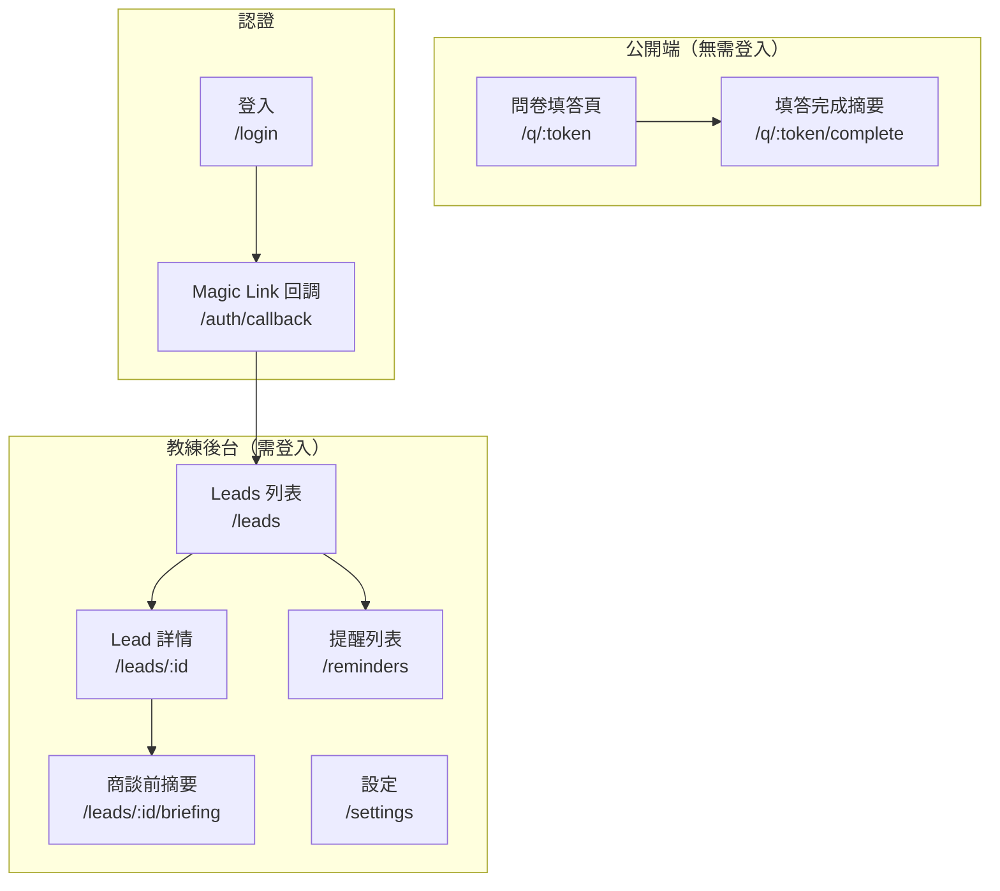
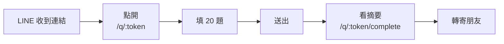
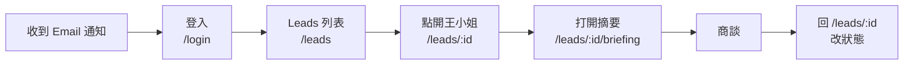
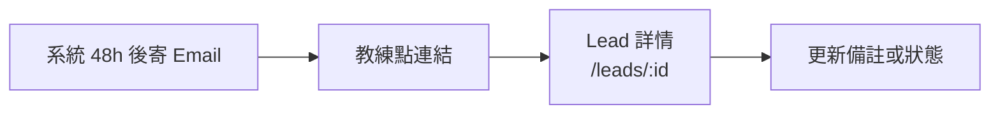

# 前端資訊架構 — Synergy AI Closer's Copilot

> **版本:** v1.0 | **更新:** 2026-04-24 | **對應 PRD:** `docs/01_prd.md`

---

## 1. 目的與範圍

**目的**：定義 Synergy AI MVP 前端的完整資訊架構，作為開發與設計的 SSOT。

| 範圍 | 說明 |
| :--- | :--- |
| **包含** | 頁面 IA、使用者旅程、導航、URL 規範、資料傳遞 |
| **不包含** | 視覺設計細節（走 Apple UI tokens）、元件實現、後端 API（見 `05_api.md`） |

---

## 2. 設計原則

**核心價值主張**：「**教練 5 分鐘就能準備好一場商談**」

### 資訊架構原則

| 原則 | 說明 |
| :--- | :--- |
| **簡化** | 保留：填問卷、看摘要、更新狀態、收提醒 / 移除：設定、儀表板、社群功能 / 專注：從「新名單」到「成交」的最短路徑 |
| **認知負荷** | 每頁 1 個主要目標；商談摘要頁是「單頁可讀完」的最高原則 |
| **架構模式** | **混合**：公開端扁平（問卷）+ 教練端層級化（CRM → Lead → 摘要） |
| **行動優先** | 教練 80% 在手機上看摘要，所有頁面 mobile-first |

---

## 3. 資訊架構總覽

### 系統層次結構

### 頁面總覽

| # | 路由 | 頁面名稱 | 主要職責 | 使用者目標 | 層級 |
| :---: | :--- | :--- | :--- | :--- | :--- |
| 1 | `/q/:token` | 問卷填答 | 讓潛在客戶無登入完成 20 題問卷 | 5 分鐘內填完、保有隱私 | L0 公開 |
| 2 | `/q/:token/complete` | 填答完成摘要 | 呈現填答者個人健康摘要 + 轉寄 | 拿到可信的健康建議 | L0 公開 |
| 3 | `/login` | 登入 | 教練輸入 Email 接收 Magic Link | 1 分鐘內進入後台 | L0 公開 |
| 4 | `/auth/callback` | Magic Link 回調 | Supabase 認證處理 | 自動導向 | 中繼 |
| 5 | `/leads` | Leads 列表（CRM） | 教練看全部客戶、搜尋、篩選 | 30 秒找到要跟進的人 | L1 |
| 6 | `/leads/:id` | Lead 詳情 | 客戶完整資料 + 問卷答案 + 狀態操作 | 掌握客戶脈絡 | L2 |
| 7 | `/leads/:id/briefing` | 商談前摘要（★ 核心） | 單頁 AI 摘要（痛點/推薦/異議/切入） | 商談前 5 分鐘準備完成 | L3 |
| 8 | `/reminders` | 提醒列表 | 查看所有待處理/已發送提醒 | 看哪些名單要追 | L1 |
| 9 | `/settings` | 設定 | Email、時區、通知開關 | 調整個人偏好 | L1 |
| — | `/404`、`/error` | 錯誤頁 | 404 + 通用錯誤 | 回首頁或登入 | — |

**總計**：9 頁主要 + 2 頁錯誤 = **11 頁**。

---

## 4. 核心使用者旅程

### 旅程 A：潛在客戶填問卷

| 階段 | 頁面 | 使用者心理 | 設計目標 | 主要 CTA | 轉換目標 |
| :--- | :--- | :--- | :--- | :--- | :--- |
| 點入 | `/q/:token` | 好奇但警戒 | 降低心理門檻 | 開始填寫 | 60%+ 開始填 |
| 填答 | `/q/:token` | 邊填邊猶豫 | 進度視覺化 + 可跳題 | 下一題 / 標記不便說 | 50%+ 填完 |
| 送出 | `/q/:token` | 有點焦慮 | 清楚說明後續 | 送出 | 95%+ 完成率 |
| 看結果 | `/q/:token/complete` | 想看結果 | 摘要易讀 + 強調專業性 | 轉寄給朋友 | 10%+ 轉寄率 |

### 旅程 B：教練商談前準備

| 階段 | 頁面 | 使用者心理 | 設計目標 | 主要 CTA | 轉換目標 |
| :--- | :--- | :--- | :--- | :--- | :--- |
| 登入 | `/login` | 趕時間 | Magic Link 1 步到位 | 送出 Email | — |
| 找人 | `/leads` | 多個客戶要跟 | 搜尋 + 篩選快 | 點客戶姓名 | — |
| 掌握脈絡 | `/leads/:id` | 要快速複習 | 摘要連結明顯 | 打開商談摘要 | 90%+ |
| 商談準備 | `/leads/:id/briefing` | 緊張 | 單頁可滑完 | — | — |
| 收尾 | `/leads/:id` | 商談結束 | 狀態切換一鍵 | 改狀態 | — |

### 旅程 C：自動跟進

---

## 5. 導航結構

### 主導航（教練後台 Sidebar）

| 項目 | 連結 | 圖示 | 顯示條件 |
| :--- | :--- | :--- | :--- |
| 客戶名單 | `/leads` | Users | 登入 |
| 提醒 | `/reminders` | Bell（Badge 顯示未處理數） | 登入 |
| 設定 | `/settings` | Settings | 登入 |

### 輔助導航

- **麵包屑**：`Leads > 王小姐 > 商談摘要`（僅在 L3 顯示）
- **Footer**：無（MVP 不做）
- **Mobile Bottom Bar**：`/leads`（首頁）+ `/reminders` + `/settings` 三顆
- **快速動作**：Lead 詳情右上角「打開商談摘要」按鈕（橘色突出）

### 公開端（問卷頁）

- **無導航**，只有進度條與「送出」按鈕
- **Footer** 可放「本資料僅供健康參考，非醫療診斷」聲明

---

## 6. 頁面規格

### 6.1 `/q/:token` — 問卷填答

| 項目 | 內容 |
| :--- | :--- |
| **路由** | `/q/:token` |
| **職責** | 單頁滾動式問卷，每題一張卡片 |
| **資料需求** | `GET /v1/questionnaires/:token` |
| **使用者行動** | 填寫 / 跳題 / 標記不便說 / 送出 |
| **導航入口** | 教練透過 LINE / Email 分享連結 |
| **導航出口** | `/q/:token/complete`（送出後）、關閉瀏覽器（未送出則自動儲存） |
| **關鍵 UX** | - 頂部進度條（8/20） - 「隱私保護」標籤在敏感題旁 - 每 2 題自動儲存 - 可返回上一題修改 |
| **狀態** | 載入中 / 填答中 / 驗證錯誤 / 送出中 / 完成 |

### 6.2 `/q/:token/complete` — 填答完成摘要

| 項目 | 內容 |
| :--- | :--- |
| **路由** | `/q/:token/complete` |
| **職責** | 呈現填答者個人健康摘要（友善版本，不含商業語氣） |
| **資料需求** | 送出回應中的 `public_summary` |
| **使用者行動** | 轉寄給朋友 / 刪除我的資料 |
| **導航入口** | 從問卷送出 |
| **導航出口** | 關閉 / 分享 |
| **關鍵 UX** | - 健康等級視覺化（A/B/C 徽章） - 3 點主要發現 - 聲明：「非醫療診斷」 - 可愛 emoji 強調正向 |

### 6.3 `/login` — 登入

| 項目 | 內容 |
| :--- | :--- |
| **路由** | `/login` |
| **職責** | Email 輸入 → Supabase Magic Link |
| **資料需求** | 無 |
| **使用者行動** | 輸入 Email、送出 |
| **導航出口** | Email 收信 → `/auth/callback` → `/leads` |
| **關鍵 UX** | 送出後立刻顯示「請至 Email 收信」指引 + 可改 Email 重試 |

### 6.4 `/leads` — Leads 列表（CRM 核心）

| 項目 | 內容 |
| :--- | :--- |
| **路由** | `/leads?status=new&health_level=A&q=王&page=1` |
| **職責** | 表格式 + 卡片式雙檢視，搜尋與篩選 |
| **資料需求** | `GET /v1/leads?...` |
| **使用者行動** | 搜尋 / 篩選 / 排序 / 點進 Lead |
| **導航入口** | 登入後首頁、側邊欄 |
| **導航出口** | `/leads/:id` |
| **關鍵 UX** | - 手機版：卡片 + swipe 改狀態 - 桌機版：表格 - Sticky 搜尋列 - 空狀態：「還沒有名單，分享問卷給朋友」 |
| **預設排序** | `last_contact_at desc`（最近聯繫在上） |

### 6.5 `/leads/:id` — Lead 詳情

| 項目 | 內容 |
| :--- | :--- |
| **路由** | `/leads/:id` |
| **職責** | 客戶完整資料 + 問卷答案 + 狀態操作 + 跳到摘要 |
| **資料需求** | `GET /v1/leads/:id`（含 answers） |
| **使用者行動** | 查看問卷答案 / 改狀態 / 改備註 / 打開摘要 |
| **導航入口** | `/leads`、Email 提醒連結 |
| **導航出口** | `/leads/:id/briefing`（醒目橘色按鈕）、回 `/leads` |
| **關鍵 UX** | - 頂部：姓名 + 健康徽章 + 狀態 pill - 中段：問卷答案（可摺疊） - 右上：**「打開商談摘要」浮動按鈕** |

### 6.6 `/leads/:id/briefing` — 商談前摘要（★ 核心頁 ★）

| 項目 | 內容 |
| :--- | :--- |
| **路由** | `/leads/:id/briefing` |
| **職責** | 教練商談前 5 分鐘打開就能看完的單頁摘要 |
| **資料需求** | `GET /v1/leads/:id/briefing` |
| **使用者行動** | 滾動閱讀 / 重新生成 / 返回 Lead |
| **導航入口** | `/leads/:id` 唯一入口 |
| **導航出口** | 返回 `/leads/:id` |
| **關鍵 UX** | - **單頁可滑完，一頁結束** - 區塊順序（從上到下）： &nbsp;&nbsp;1. 客戶姓名 + 上次商談時間 &nbsp;&nbsp;2. **三句話痛點**（大字、醒目） &nbsp;&nbsp;3. **推薦產品組合**（卡片 + 理由） &nbsp;&nbsp;4. **預期異議 + 回覆建議**（對話框式） &nbsp;&nbsp;5. **切入角度** &nbsp;&nbsp;6. 底部：重新生成 / 返回 - 預設深色閱讀模式（商談場合光線不穩） |
| **效能** | 3G 網路 ≤ 2s 載入 |

### 6.7 `/reminders` — 提醒列表

| 項目 | 內容 |
| :--- | :--- |
| **路由** | `/reminders?status=pending` |
| **職責** | 查看待處理 / 已發送 / 已取消提醒 |
| **資料需求** | `GET /v1/reminders` |
| **使用者行動** | 點提醒 → 跳到 Lead 詳情 |
| **導航入口** | 側邊欄 Badge、Email 連結 |
| **導航出口** | `/leads/:id` |

### 6.8 `/settings` — 設定

| 項目 | 內容 |
| :--- | :--- |
| **路由** | `/settings` |
| **職責** | Email、時區、通知開關、登出 |
| **使用者行動** | 修改 / 登出 |

---

## 7. URL 結構與路由

### 命名規範

- 小寫、連字符：`/leads`、`/reminders`
- 資源 ID：`/leads/:id`
- 巢狀：`/leads/:id/briefing`
- 查詢參數：過濾/排序/分頁 `?status=talked&sort_by=-last_contact_at&page=1`

### 路由表

| 路由 | 元件 | 認證 | 載入策略 | Meta |
| :--- | :--- | :--- | :--- | :--- |
| `/q/:token` | QuestionnairePage | 否 | SSG shell + CSR 資料 | noindex |
| `/q/:token/complete` | QuestionnaireCompletePage | 否 | CSR | noindex |
| `/login` | LoginPage | 否 | 預載 | index |
| `/auth/callback` | AuthCallbackPage | 否 | CSR | noindex |
| `/leads` | LeadsListPage | 是 | 預載 + React Query | noindex |
| `/leads/:id` | LeadDetailPage | 是 | React Query | noindex |
| `/leads/:id/briefing` | BriefingPage | 是 | React Query（含 polling if pending） | noindex |
| `/reminders` | RemindersPage | 是 | 懶載入 | noindex |
| `/settings` | SettingsPage | 是 | 懶載入 | noindex |

---

## 8. 資料流與狀態

### 頁面間資料傳遞

| 來源 | 目標 | 傳遞方式 | 資料 |
| :--- | :--- | :--- | :--- |
| `/q/:token`（送出） | `/q/:token/complete` | API 回應（React Query cache） | public_summary |
| `/leads` | `/leads/:id` | URL param + React Query prefetch | lead_id、list cache |
| `/leads/:id` | `/leads/:id/briefing` | URL param | lead_id |
| Email 連結 | `/leads/:id` | URL deep link | lead_id |

### 全局狀態

- **Auth**：Supabase client（自動持久化）
- **API 快取**：React Query（`staleTime: 30s` 預設）
- **表單**：React Hook Form + Zod 驗證

---

## 9. 響應式斷點

| 斷點 | 寬度 | 主要設計對象 |
| :--- | :--- | :--- |
| sm | < 640px | 手機（教練商談實際場景） |
| md | 640-1024px | 平板 |
| lg | > 1024px | 桌機（CRM 大量瀏覽） |

**行動優先順序**：`/q/*` 與 `/leads/:id/briefing` **純手機設計**，`/leads` 列表桌機優化。

---

## 10. 無障礙與效能

### A11y
- 所有按鈕有 `aria-label`
- Form 有 `<label>` 對應
- 色彩對比 WCAG AA
- 鍵盤可完全操作

### 效能預算
- 首屏 JS ≤ 200 KB（gzipped）
- LCP < 2.5s（3G）
- CLS < 0.1
- TTI < 3.5s

---

## 11. 檢查清單

### 資訊架構
- [x] 所有頁面已定義職責與使用者目標
- [x] 核心使用者旅程已映射（3 條）
- [x] 導航結構清晰且一致
- [x] URL 結構語義化

### 可用性
- [x] 導航深度 ≤ 3 層（`/leads/:id/briefing`）
- [x] 每頁只有 1 個主要 CTA（最高優先：商談摘要頁的「重新生成」）
- [x] 麵包屑導航可回溯
- [x] 404/錯誤頁面有引導
- [x] Mobile-first 且可離線查看商談摘要（Phase 2 PWA）
