# 類別/元件關係文件 - n8n 個人品牌內容分發平台

> **版本:** v1.0 | **更新:** 2026-03-17 | **狀態:** 草稿

---

## 核心類別圖

```mermaid
classDiagram
    direction TB

    %% === Domain Layer ===

    class Content {
        +id: string
        +title: string
        +master_caption: string
        +image_url: string | null
        +platforms: string
        +publish_at: Date | null
        +status: ContentStatus
        +fb_caption: string | null
        +ig_caption: string | null
        +x_caption: string | null
        +line_message: string | null
        +retry_count: number
        +last_error: string | null
        +created_at: Date
        +updated_at: Date
    }

    class PublishLog {
        +log_id: string
        +content_id: string
        +platform: Platform
        +status: PublishStatus
        +external_post_id: string | null
        +response_summary: string | null
        +workflow_execution_id: string | null
        +created_at: Date
    }

    class MonitorData {
        +id: string
        +content_id: string
        +platform: Platform
        +external_post_id: string
        +likes: number
        +comments: number
        +shares: number
        +recent_replies: Reply[]
        +fetched_at: Date
    }

    class ContentStatus {
        <<enumeration>>
        DRAFT
        QUEUED
        PUBLISHING
        SUCCESS
        PARTIAL_SUCCESS
        FAILED
    }

    class Platform {
        <<enumeration>>
        FB
        IG
        X
        LINE
    }

    class StatusMachine {
        -transitions: Map
        +transition(from: ContentStatus, to: ContentStatus): ContentStatus
        +canTransition(from: ContentStatus, to: ContentStatus): boolean
        +getValidTransitions(from: ContentStatus): ContentStatus[]
    }

    class ContentValidator {
        +validateCreate(data: ContentCreate): ValidationResult
        +validateUpdate(data: ContentUpdate, currentStatus: ContentStatus): ValidationResult
        +validatePlatformCaptions(data: ContentCreate): ValidationResult
    }

    %% === Repository Interfaces (Domain) ===

    class ContentRepository {
        <<Interface>>
        +findById(id: string): Content | null
        +findAll(query: ListQuery): PaginatedResult~Content~
        +create(data: ContentCreate): Content
        +update(id: string, data: ContentUpdate): Content
        +delete(id: string): void
        +countByStatus(): StatusCounts
    }

    class PublishLogRepository {
        <<Interface>>
        +create(data: CreatePublishLog): PublishLog
        +findByContentId(contentId: string, platform?: Platform): PublishLog[]
        +getLatestByContentAndPlatform(contentId: string, platform: Platform): PublishLog | null
    }

    class MonitorDataRepository {
        <<Interface>>
        +upsert(data: UpsertMonitorData): MonitorData
        +findLatestByContentId(contentId: string, platform?: Platform): MonitorData[]
        +findHistoryByContentId(contentId: string, platform?: Platform, limit?: number): MonitorData[]
    }

    %% === Application Layer ===

    class ContentService {
        -contentRepo: ContentRepository
        -validator: ContentValidator
        +createContent(data: ContentCreate): Content
        +getContent(id: string): Content
        +listContents(query: ListQuery): PaginatedResult~Content~
        +updateContent(id: string, data: ContentUpdate): Content
        +deleteContent(id: string): void
    }

    class ScheduleService {
        -contentRepo: ContentRepository
        -statusMachine: StatusMachine
        +scheduleContent(id: string, data: ScheduleCreate): Content
        +cancelSchedule(id: string): Content
    }

    class PublishService {
        -contentRepo: ContentRepository
        -logRepo: PublishLogRepository
        -statusMachine: StatusMachine
        -n8nClient: N8NClient
        -webhookVerifier: WebhookVerifier
        -sseManager: SSEManager
        +publishNow(id: string, idempotencyKey?: string): Content
        +handlePublishResult(payload: PublishResultPayload, signature: string): void
        +retryFailedPlatforms(id: string, options?: RetryRequest): Content
        +getPublishLogs(contentId: string, platform?: Platform): PublishLog[]
    }

    class MonitorService {
        -contentRepo: ContentRepository
        -monitorRepo: MonitorDataRepository
        +getDashboardOverview(): DashboardOverview
        +getDashboardContents(query: ListQuery): PaginatedResult~DashboardContent~
        +getEngagement(contentId: string, platform?: Platform): EngagementData[]
        +getReplies(contentId: string, query: ListQuery): PaginatedResult~Reply~
    }

    %% === Infrastructure Layer ===

    class PrismaContentRepository {
        -prisma: PrismaClient
        +findById(id: string): Content | null
        +findAll(query: ListQuery): PaginatedResult~Content~
        +create(data: ContentCreate): Content
        +update(id: string, data: ContentUpdate): Content
        +delete(id: string): void
        +countByStatus(): StatusCounts
    }

    class PrismaPublishLogRepository {
        -prisma: PrismaClient
        +create(data: CreatePublishLog): PublishLog
        +findByContentId(contentId: string, platform?: Platform): PublishLog[]
        +getLatestByContentAndPlatform(contentId: string, platform: Platform): PublishLog | null
    }

    class PrismaMonitorDataRepository {
        -prisma: PrismaClient
        +upsert(data: UpsertMonitorData): MonitorData
        +findLatestByContentId(contentId: string, platform?: Platform): MonitorData[]
        +findHistoryByContentId(contentId: string, platform?: Platform, limit?: number): MonitorData[]
    }

    class N8NClient {
        -webhookUrl: string
        -timeout: number
        +triggerPublish(content: Content, platforms: Platform[]): void
        +healthCheck(): boolean
    }

    class WebhookVerifier {
        -secret: string
        +verify(body: string, signature: string): boolean
    }

    class SSEManager {
        -connections: Map
        +addConnection(channel: string, response: ServerResponse): void
        +removeConnection(channel: string, response: ServerResponse): void
        +broadcast(channel: string, event: string, data: object): void
    }

    %% === Relationships ===

    Content "1" *-- "0..*" PublishLog : has many
    Content "1" *-- "0..*" MonitorData : has many
    Content --> ContentStatus : uses
    PublishLog --> Platform : uses
    MonitorData --> Platform : uses

    ContentService ..> ContentRepository : uses
    ContentService ..> ContentValidator : uses
    ContentService ..> Content : creates/reads

    ScheduleService ..> ContentRepository : uses
    ScheduleService ..> StatusMachine : uses

    PublishService ..> ContentRepository : uses
    PublishService ..> PublishLogRepository : uses
    PublishService ..> StatusMachine : uses
    PublishService ..> N8NClient : uses
    PublishService ..> WebhookVerifier : uses
    PublishService ..> SSEManager : uses

    MonitorService ..> ContentRepository : uses
    MonitorService ..> MonitorDataRepository : uses

    PrismaContentRepository ..|> ContentRepository : implements
    PrismaPublishLogRepository ..|> PublishLogRepository : implements
    PrismaMonitorDataRepository ..|> MonitorDataRepository : implements
```

---

## 類別職責

| 類別/元件 | 核心職責 | 協作者 | 所屬層 |
| :--- | :--- | :--- | :--- |
| `Content` | 貼文領域實體，包含所有貼文屬性 | ContentStatus, Platform | Domain |
| `PublishLog` | 發佈紀錄實體，記錄單次平台發佈結果 | Platform | Domain |
| `MonitorData` | 監控數據實體，記錄平台互動數據 | Platform | Domain |
| `ContentStatus` | 貼文狀態列舉 | - | Domain |
| `Platform` | 平台列舉 | - | Domain |
| `StatusMachine` | 狀態轉換規則驗證，確保合法狀態流轉 | ContentStatus | Domain |
| `ContentValidator` | 貼文建立/更新的業務規則驗證 | Content, ContentStatus | Domain |
| `ContentRepository` (Interface) | 貼文資料存取契約 | Content | Domain |
| `PublishLogRepository` (Interface) | 發佈紀錄資料存取契約 | PublishLog | Domain |
| `MonitorDataRepository` (Interface) | 監控數據資料存取契約 | MonitorData | Domain |
| `ContentService` | 編排貼文 CRUD 業務流程 | ContentRepository, ContentValidator | Application |
| `ScheduleService` | 編排排程設定/取消流程 | ContentRepository, StatusMachine | Application |
| `PublishService` | 編排發佈、結果處理、補發流程 | ContentRepo, LogRepo, StatusMachine, N8NClient, WebhookVerifier, SSEManager | Application |
| `MonitorService` | 編排監控數據查詢、儀表板彙整 | ContentRepository, MonitorDataRepository | Application |
| `PrismaContentRepository` | Prisma 實現貼文資料存取 | PrismaClient | Infrastructure |
| `PrismaPublishLogRepository` | Prisma 實現發佈紀錄存取 | PrismaClient | Infrastructure |
| `PrismaMonitorDataRepository` | Prisma 實現監控數據存取 | PrismaClient | Infrastructure |
| `N8NClient` | 封裝 n8n Webhook HTTP 呼叫 | - | Infrastructure |
| `WebhookVerifier` | HMAC-SHA256 簽名驗證 | - | Infrastructure |
| `SSEManager` | Server-Sent Events 連線與廣播管理 | - | Infrastructure |

---

## 關係說明

| 關係類型 | UML 符號 | 本專案範例 |
| :--- | :--- | :--- |
| 組合 | `*--` | Content *-- PublishLog（貼文刪除時紀錄一併刪除） |
| 組合 | `*--` | Content *-- MonitorData（貼文刪除時數據一併刪除） |
| 實現 | `..\|>` | PrismaContentRepository implements ContentRepository |
| 依賴 | `..>` | ContentService uses ContentRepository（透過 DI） |
| 依賴 | `..>` | PublishService uses N8NClient |
| 使用 | `-->` | Content uses ContentStatus（屬性型別） |

---

## 設計模式

| 模式 | 應用場景 | 目的 |
| :--- | :--- | :--- |
| **Repository Pattern** | ContentRepository / PublishLogRepository / MonitorDataRepository | 資料存取與業務邏輯解耦，便於替換資料來源與測試 |
| **依賴注入 (DI)** | Service 建構式注入 Repository 介面 | 降低耦合，單元測試可注入 Mock Repository |
| **狀態模式 (State Machine)** | StatusMachine 管理 Content 狀態轉換 | 集中管理狀態流轉規則，防止非法轉換 |
| **觀察者模式 (Observer)** | SSEManager 廣播狀態變更事件 | 前端即時接收發佈狀態更新 |
| **策略模式 (Strategy)** | n8n 中各平台 Adapter 為獨立策略 | 平台整合邏輯可獨立替換與擴充 |
| **信封模式 (Envelope)** | API 回應統一格式 `{ success, data, error, meta }` | 前端處理回應的一致性 |
| **冪等性 (Idempotency)** | Idempotency-Key 於 publish/retry 端點 | 防止網路重試導致重複發佈 |

---

## SOLID 原則檢核

- [x] **S** 單一職責: ContentService 只管 CRUD，ScheduleService 只管排程，PublishService 只管發佈，MonitorService 只管監控
- [x] **O** 開放封閉: 新增平台只需在 n8n 加 Adapter + Platform 列舉加值，不修改既有 Service
- [x] **L** 里氏替換: PrismaContentRepository 可完全替換 ContentRepository 介面
- [x] **I** 介面隔離: 三個 Repository 介面各自獨立，Service 只依賴需要的介面
- [x] **D** 依賴反轉: Service 依賴 Repository 介面（Domain 層），不依賴 Prisma 實現

---

## 介面契約

### ContentRepository

| 方法 | 前置條件 | 後置條件 |
| :--- | :--- | :--- |
| `findById(id)` | id 為有效 UUID 字串 | 找到回傳 Content；未找到回傳 null |
| `findAll(query)` | query 含有效的 page/limit/sort_by/status | 回傳 PaginatedResult，data 為 Content 陣列 |
| `create(data)` | data 通過 ContentCreate 驗證 | 回傳新建 Content，id 已產生，status="draft" |
| `update(id, data)` | id 存在，data 為部分更新欄位 | 回傳更新後 Content，updated_at 已更新 |
| `delete(id)` | id 存在 | 記錄已從資料庫移除 |
| `countByStatus()` | 無 | 回傳各狀態的計數物件 |

### PublishLogRepository

| 方法 | 前置條件 | 後置條件 |
| :--- | :--- | :--- |
| `create(data)` | data 含有效 content_id 與 platform | 回傳新建 PublishLog，log_id 已產生 |
| `findByContentId(contentId, platform?)` | contentId 為有效 UUID | 回傳 PublishLog 陣列，按 created_at 降序 |
| `getLatestByContentAndPlatform(contentId, platform)` | contentId 與 platform 有效 | 回傳最新一筆或 null |

### MonitorDataRepository

| 方法 | 前置條件 | 後置條件 |
| :--- | :--- | :--- |
| `upsert(data)` | data 含 content_id、platform、external_post_id | 存在則更新，不存在則新增 |
| `findLatestByContentId(contentId, platform?)` | contentId 有效 | 回傳各平台最新一筆 MonitorData |
| `findHistoryByContentId(contentId, platform?, limit?)` | contentId 有效 | 回傳歷史紀錄，按 fetched_at 降序 |

### N8NClient

| 方法 | 前置條件 | 後置條件 |
| :--- | :--- | :--- |
| `triggerPublish(content, platforms)` | content 有效，platforms 非空 | n8n Webhook 已被呼叫；不可達時拋出 ServiceUnavailableError |
| `healthCheck()` | 無 | 回傳 true（可達）或 false（不可達） |

### WebhookVerifier

| 方法 | 前置條件 | 後置條件 |
| :--- | :--- | :--- |
| `verify(body, signature)` | body 為原始請求字串，signature 為 X-N8N-Signature 值 | 驗證通過回傳 true；失敗拋出 AuthenticationError |

### SSEManager

| 方法 | 前置條件 | 後置條件 |
| :--- | :--- | :--- |
| `addConnection(channel, response)` | channel 為有效頻道 ID | 連線已註冊 |
| `removeConnection(channel, response)` | channel 存在 | 連線已移除 |
| `broadcast(channel, event, data)` | channel 存在 | 所有訂閱該頻道的連線收到事件 |
