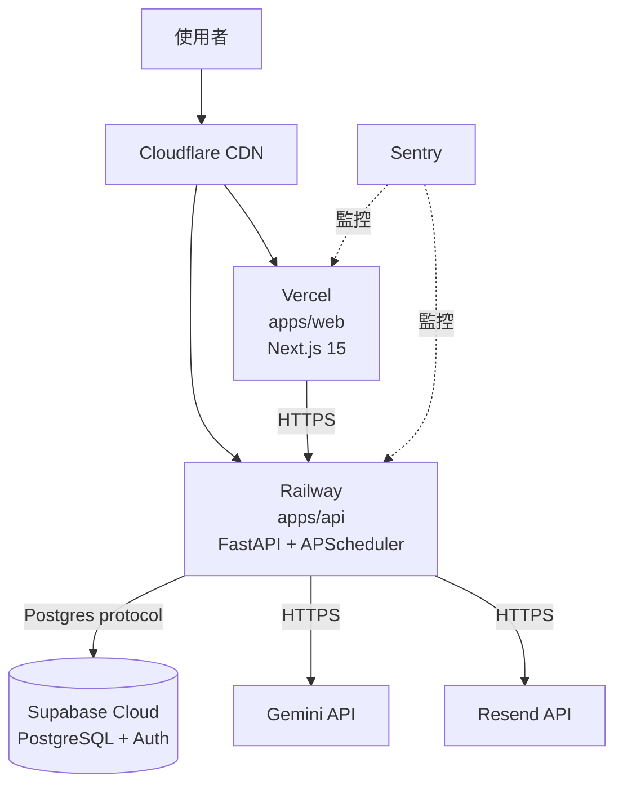

# 部署與維運指南 — Synergy AI Closer's Copilot

> **版本:** v1.0 | **更新:** 2026-04-24 | **對應架構：** `docs/04_architecture.md §5`

---

## 1. 部署拓撲



---

## 2. 環境矩陣

| 環境 | 用途 | URL | 資料 | 部署觸發 |
| :--- | :--- | :--- | :--- | :--- |
| **local** | 開發 | localhost:3000 / :8000 | Supabase local 或 staging | `pnpm dev` + `uv run` |
| **staging** | 內部驗證 | staging.synergy-ai.tw / api-staging.synergy-ai.tw | Supabase free project | merge to `main` |
| **production** | Pilot 教練使用 | app.synergy-ai.tw / api.synergy-ai.tw | Supabase Pro | Git tag `v*.*.*` |

---

## 3. CI/CD Pipeline

### 3.1 PR 流程（`.github/workflows/pr.yml`）

```yaml
name: PR Checks
on: pull_request

jobs:
  frontend:
    runs-on: ubuntu-latest
    steps:
      - uses: actions/checkout@v4
      - uses: pnpm/action-setup@v2
      - run: pnpm install --frozen-lockfile
      - run: pnpm -F @synergy/web lint
      - run: pnpm -F @synergy/web typecheck
      - run: pnpm -F @synergy/web test
      - run: pnpm -F @synergy/web build

  backend:
    runs-on: ubuntu-latest
    steps:
      - uses: actions/checkout@v4
      - uses: astral-sh/setup-uv@v3
      - run: uv sync --directory apps/api
      - run: uv run --directory apps/api ruff check
      - run: uv run --directory apps/api mypy src
      - run: uv run --directory apps/api pytest --cov --cov-fail-under=80

  security:
    runs-on: ubuntu-latest
    steps:
      - uses: actions/checkout@v4
      - uses: gitleaks/gitleaks-action@v2
      - run: pnpm audit --audit-level=high
      - run: uv run --directory apps/api pip-audit
```

### 3.2 Merge to main（Staging 部署）

- Vercel 自動從 `main` branch 部署 → `staging.synergy-ai.tw`
- Railway 自動偵測 `apps/api` 變更 → Staging service
- Supabase migration 手動執行：`./scripts/migrate.sh staging`

### 3.3 Tag v* → Production

```yaml
name: Production Deploy
on:
  push:
    tags: ['v*.*.*']

jobs:
  deploy-web:
    runs-on: ubuntu-latest
    steps:
      - uses: amondnet/vercel-action@v25
        with:
          vercel-token: ${{ secrets.VERCEL_TOKEN }}
          vercel-args: --prod

  deploy-api:
    runs-on: ubuntu-latest
    steps:
      - uses: bervProject/railway-deploy@main
        with:
          service: api-production
          token: ${{ secrets.RAILWAY_TOKEN }}

  smoke-test:
    needs: [deploy-web, deploy-api]
    steps:
      - run: curl -f https://api.synergy-ai.tw/health
      - run: pnpm -F @synergy/web playwright test tests/e2e/smoke.spec.ts
```

**回滾**：Vercel / Railway UI 一鍵回滾到前一版；或刪除 tag 後重 push 舊版。

---

## 4. Supabase Migration

### 4.1 目錄結構

```
apps/api/src/infrastructure/persistence/migrations/
├── 001_init_schema.sql
├── 002_add_tenant_id.sql
├── 003_add_reminders.sql
└── ...
```

### 4.2 執行流程

```bash
# 本機
./scripts/migrate.sh local

# Staging（merge 後手動）
./scripts/migrate.sh staging

# Production（tag 前手動 + 備份）
./scripts/backup.sh production
./scripts/migrate.sh production
```

### 4.3 規則

- **不可破壞性變更**：add column / add table / add index
- **破壞性變更**（drop/rename）：分三步
  1. 新增新欄位 + code 雙寫
  2. 下一版 deploy 後遷移資料
  3. 再下一版刪除舊欄位

---

## 5. 監控與告警

### 5.1 SLO 目標（MVP Pilot）

| 指標 | SLO | 測量 | 告警閾值 |
| :--- | :--- | :--- | :--- |
| API 可用性 | ≥ 95% | UptimeRobot `/health` 1-min | < 95%/小時 |
| API p95 延遲（非 LLM） | ≤ 500ms | Sentry Performance | > 1s 持續 10min |
| LLM 成功率 | ≥ 95% | 自訂 metric | < 90%/小時 |
| Reminder 準時率 | ≥ 95%（±1h） | 自訂 audit | < 90%/日 |
| 錯誤率 | ≤ 1% | Sentry | > 5% 持續 5min |

### 5.2 監控工具

| 工具 | 用途 | 成本 |
| :--- | :--- | :--- |
| Sentry | 錯誤追蹤、APM、前後端統一 | Free 5k events/month |
| UptimeRobot | 可用性 ping | Free 50 monitor |
| Supabase Logs | DB 查詢、Auth log | 內建 |
| Vercel Analytics | Web vitals | Free |
| Railway Metrics | CPU / RAM / egress | 內建 |

### 5.3 告警通道

- CRITICAL：Email + Telegram bot（觸發 PagerDuty 太重）
- WARN：Email 每日摘要

### 5.4 SLI 埋點關鍵

- `questionnaire.submit.success_rate`
- `briefing.generate.latency_p95`
- `briefing.generate.llm_cost_per_day_ntd`
- `reminder.dispatch.on_time_rate`
- `crm.api.p95_latency`

---

## 6. 成本控管

### 6.1 月度預算（Pilot 階段）

| 項目 | 預算 (NTD) | 超標告警 |
| :--- | :--- | :--- |
| Supabase | 0-800 | 達 Pro 方案額度 |
| Gemini API | 300 | > 500 NTD 告警 |
| Vercel | 0 | Hobby plan 限額 |
| Railway | 500 | > 1,000 NTD 告警 |
| LINE Messaging API | 800 | Light plan 15k 訊息；若月推播 > 15k 升級 Standard（1,600 NTD） |
| Resend（備援） | 0 | > 3k 封 |
| 網域 | 60 | — |
| **總計** | **< 2,300** | > 2,800 告警 |

### 6.2 LLM 成本控管策略

1. **日預算上限**：Gemini 每日 $0.50 USD，達上限切降級模型
2. **Token budget per request**：輸出上限 2500 tokens
3. **Prompt 優化**：簡化 system prompt，避免重複上下文
4. **快取**：Briefing 一次生成永久存（ADR-009）
5. **降級策略**：Claude Haiku 4.5（若品質要求升級）

### 6.3 成本儀表板

每週一寄送 Email：上週各服務用量與金額。

---

## 7. 備份與災難恢復

### 7.1 備份

| 資料 | 頻率 | 保留 | 方式 |
| :--- | :--- | :--- | :--- |
| Supabase DB | 每日自動 | 7 天（Free）/ 30 天（Pro） | Supabase 內建 |
| 使用者檔案（Storage） | 每日 | 30 天 | Supabase 內建 |
| 設定（env） | 變更時 | Git + 1Password | 手動 |

### 7.2 RTO / RPO

| 事件 | RTO | RPO |
| :--- | :--- | :--- |
| Railway 宕機 | 30 分鐘（切 Fly.io） | 0 |
| Supabase 宕機 | 4 小時（PG dump 還原至 Neon） | < 24 小時 |
| Vercel 宕機 | 30 分鐘（切 Cloudflare Pages） | 0 |
| Gemini 宕機 | 5 分鐘（LiteLLM 切 Claude） | 0 |

### 7.3 災難演練

- 每季一次：模擬 DB 還原（從備份 → staging）
- 每季一次：模擬金鑰輪替
- Pilot 開始前一週：演練一次

---

## 8. 本機開發環境

### 8.1 必要工具

- Python 3.12 + `uv`
- Node.js 20 LTS + `pnpm@9`
- Docker（跑 Supabase local）
- Supabase CLI

### 8.2 Setup

```bash
git clone https://github.com/{org}/synergy.git
cd synergy
cp .env.example .env.local
# 填入 staging 的金鑰

# Backend
cd apps/api && uv sync

# Frontend
cd ../../ && pnpm install

# Supabase local
npx supabase start

# Run
pnpm dev  # 同時啟動前後端
```

### 8.3 常用指令

| 指令 | 用途 |
| :--- | :--- |
| `pnpm dev` | 啟動前後端 |
| `pnpm test` | 跑所有測試 |
| `pnpm lint` | Lint + format |
| `./scripts/migrate.sh local` | 跑 migration |
| `./scripts/seed-dev-data.py` | 填測試資料 |

---

## 9. Runbook（常見維運任務）

### 9.1 LLM API 失敗爆量

1. 開啟 Sentry 確認錯誤類型
2. 檢查 Gemini console 是否服務中斷
3. 若是供應商問題 → `LLM_PROVIDER=anthropic` env 切換後 redeploy
4. 若是我方問題 → 查 prompt / rate limit

### 9.2 Reminder 沒準時發送

1. 檢查 Railway APScheduler 容器是否運行
2. 查 `/v1/reminders?status=pending&overdue=true`
3. 若有堆積，手動觸發 `POST /v1/internal/reminders/scan`
4. 檢查 LINE Messaging API console：是否超限、有被封鎖、webhook 是否可用
5. 查 `reminders.channel_attempts`：若 line 全部 failed，確認教練是否解除綁定
6. 若 LINE 整體中斷：設定 `NOTIFICATION_PRIMARY_CHANNEL=email` redeploy，全部走備援
7. 檢查 Resend console 是否被 block

### 9.3 Supabase Free 額度耗盡

1. 升級 Pro（25 USD/mo）
2. 或：刪除舊 audit log、重生 Briefing 的 JSONB 去冗余

### 9.4 金鑰外洩

1. 立即在對應 console 撤銷金鑰
2. 產生新金鑰並更新部署平台 env
3. Redeploy 所有受影響服務
4. 檢查 log 是否有異常存取
5. 若涉客戶資料，走 §11 事故回應流程

---

## 10. 擴容路徑（Phase 2 準備）

| 階段 | 觸發條件 | 調整 |
| :--- | :--- | :--- |
| Pilot → Phase 2 | 3 位 → 20 位教練 | Railway Pro、Supabase Pro |
| Phase 2 → Multi-tenant | 簽第 2 家客戶 | 啟用 RLS tenant 切換；多網域 CDN |
| Multi-tenant → 跨區 | 美國客戶簽約 | 新增 us-east Supabase instance；GeoDNS |

---

## 11. 事故回應流程（完整版）

（安全相關見 `10_security.md §11`）

### 11.1 嚴重度分級

| 等級 | 定義 | 通知時限 |
| :--- | :--- | :--- |
| **SEV-1** | 服務完全中斷 / 資料遺失 | < 15 min |
| **SEV-2** | 核心功能不可用（商談摘要無法生成） | < 1 hour |
| **SEV-3** | 邊緣功能異常（提醒延遲） | < 4 hours |
| **SEV-4** | 單一使用者問題 | 下一工作天 |

### 11.2 SEV-1/2 回應步驟

1. **宣告**：Telegram 群組發 `[SEV-1] <summary>`
2. **成立戰情室**：15 分鐘內聚集負責人
3. **遏制**：rollback / feature flag 關閉
4. **溝通**：
   - 內部：每 30 分鐘更新
   - 對 Pilot 教練：透過 LINE 群公告
5. **修復**：熱修 + staging 驗證 + prod 部署
6. **覆盤**：48 小時內寫 postmortem（`docs/incidents/YYYY-MM-DD-<slug>.md`）

---

## 12. 上線前 Checklist

### 技術
- [ ] 所有 CI check 綠燈
- [ ] Migration 已跑（staging 驗證）
- [ ] 環境變數齊全
- [ ] TLS A 評級
- [ ] Sentry 接入
- [ ] UptimeRobot 設定

### 業務
- [ ] 3 位 Pilot 教練同意書簽妥
- [ ] 教練 30 分鐘上線訓練完成（含 LINE OA 綁定步驟）
- [ ] **LINE Official Account 審核通過 + Messaging API channel 可推播**
- [ ] **3 位 Pilot 教練全部完成 LINE OA 綁定（line_user_id 已寫入 DB）**
- [ ] LINE 訊息範本審核完成（若使用 push message template）
- [ ] Privacy Policy + ToS 上線
- [ ] 問卷題目最終版已鎖定
- [ ] LLM prompt 迭代 ≥ 3 輪驗證

### 維運
- [ ] 備份驗證已跑
- [ ] 告警通道測試
- [ ] Runbook 已撰寫（§9）
- [ ] 金鑰已輪替為正式版
