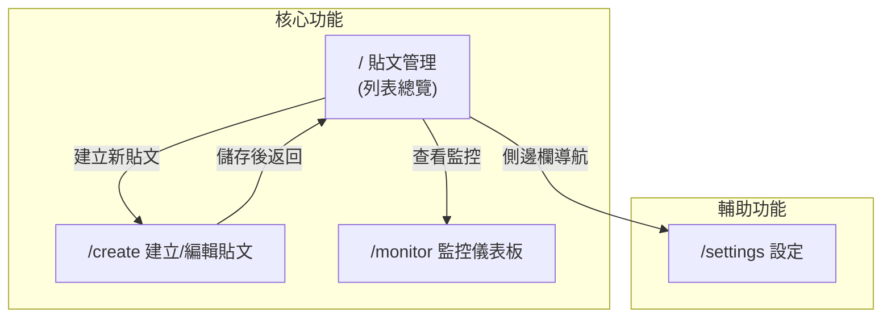
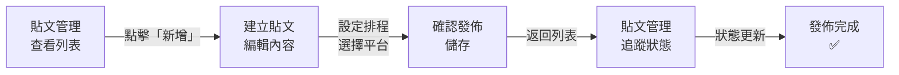
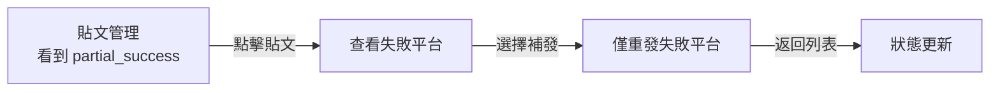

# 前端資訊架構規範 - Personal Content Distributor v2

> **版本:** v1.0 | **更新:** 2026-03-19 | **狀態:** 草稿
> **相關文檔:** [PRD](./02_project_brief_and_prd.md) | [前端架構](./12_frontend_architecture_specification.md)

---

## 1. 目的與範圍

**目的**: 定義前端完整資訊架構，作為開發與設計的 SSOT。

| 範圍 | 說明 |
| :--- | :--- |
| **包含** | 頁面資訊架構、使用者旅程、導航設計、URL 規範、資料傳遞 |
| **不包含** | 視覺設計細節、元件實現、後端 API 規格 |

---

## 2. 設計原則

**核心價值主張:** 「一個介面，管理所有平台的內容發佈與互動監控」

### 資訊架構原則

| 原則 | 說明 |
| :--- | :--- |
| 簡化 | 保留: 貼文 CRUD、發佈管理、監控 / 移除: 留言回覆、AI 生成 / 專注: 高效發佈 |
| 認知負荷 | 每頁 1 個主要目標，先總覽再深入 |
| 架構模式 | 扁平化 — 所有核心功能一層可達 |

---

## 3. 資訊架構總覽

### 系統層次結構



### 頁面總覽

| # | 路由 | 頁面名稱 | 主要職責 | 使用者目標 | 層級 |
| :--- | :--- | :--- | :--- | :--- | :--- |
| 1 | `/` | 貼文管理 | 列表總覽、狀態追蹤、快速操作 | 一眼掌握所有貼文狀態 | L0 |
| 2 | `/create` | 建立貼文 | 內容編輯、平台選擇、排程設定 | 快速建立並排程發佈 | L1 |
| 3 | `/create?id=xxx` | 編輯貼文 | 修改既有貼文 | 修正或調整已建立的內容 | L1 |
| 4 | `/monitor` | 監控儀表板 | 互動數據、回覆彙整 | 評估內容成效 | L0 |
| 5 | `/settings` | 設定 | 平台連結、通知偏好 | 管理系統配置 | L0 |
| 6 | `*` | 404 | 錯誤引導 | 找到正確頁面 | - |

**總計:** 5 頁 (不含 404)

---

## 4. 核心使用者旅程

### 旅程一: 建立並發佈貼文 (主要流程)



| 階段 | 頁面 | 使用者心理 | 設計目標 | 主要 CTA |
| :--- | :--- | :--- | :--- | :--- |
| 瀏覽 | `/` | 「我有什麼待處理？」 | 快速總覽、狀態分類 | 新增貼文 |
| 編輯 | `/create` | 「填寫內容、選平台」 | 流暢編輯、預覽格式 | 儲存 / 立即發佈 |
| 追蹤 | `/` | 「發佈成功了嗎？」 | 即時狀態更新 | 查看詳情 / 補發 |

### 旅程二: 監控互動成效


### 旅程三: 失敗補發



---

## 5. 導航結構

### 主導航 (側邊欄 Sidebar)

| 項目 | 圖示 | 連結 | 顯示條件 |
| :--- | :--- | :--- | :--- |
| 貼文管理 | FileText | `/` | 永遠顯示 |
| 監控儀表板 | BarChart | `/monitor` | 永遠顯示 |
| 設定 | Settings | `/settings` | 永遠顯示 |

### 輔助導航

| 元素 | 位置 | 內容 |
| :--- | :--- | :--- |
| 新增貼文按鈕 | 貼文管理頁面右上 | `/create` |
| 返回按鈕 | 建立貼文頁面左上 | 返回 `/` |
| 404 引導 | NotFound 頁面 | 連結回首頁 |

---

## 6. 頁面規格

### 頁面: 貼文管理 (`/`)

| 項目 | 內容 |
| :--- | :--- |
| **路由** | `/` |
| **職責** | 顯示所有貼文的列表總覽，支援篩選、排序、狀態追蹤 |
| **資料需求** | `GET /api/v1/contents` (分頁、篩選) |
| **使用者行動** | 主要: 新增貼文 / 次要: 篩選狀態、編輯貼文、刪除貼文、補發 |
| **導航入口** | 側邊欄、建立貼文完成後返回 |
| **導航出口** | `/create` (新增/編輯)、`/monitor` (側邊欄) |

**頁面區塊:**
```
┌─────────────────────────────────────┐
│ Header: 標題 + [新增貼文] 按鈕       │
├─────────────────────────────────────┤
│ Filters: 狀態篩選 + 平台篩選 + 搜尋  │
├─────────────────────────────────────┤
│ Content List:                        │
│ ┌─ ContentCard ──────────────────┐  │
│ │ 標題 | 狀態Badge | 平台Tags    │  │
│ │ 排程時間 | 操作選單             │  │
│ └────────────────────────────────┘  │
│ ┌─ ContentCard ──────────────────┐  │
│ │ ...                             │  │
│ └────────────────────────────────┘  │
├─────────────────────────────────────┤
│ Pagination                           │
└─────────────────────────────────────┘
```

### 頁面: 建立/編輯貼文 (`/create`)

| 項目 | 內容 |
| :--- | :--- |
| **路由** | `/create` (新增) 或 `/create?id=xxx` (編輯) |
| **職責** | 貼文內容編輯、平台選擇、排程設定、平台專屬文案 |
| **資料需求** | 新增: 無 / 編輯: `GET /api/v1/contents/:id` |
| **使用者行動** | 主要: 儲存草稿 / 立即發佈 / 排程發佈 |
| **導航入口** | 貼文管理「新增」或「編輯」 |
| **導航出口** | 儲存後返回 `/` |

**頁面區塊:**
```
┌──────────────────────────────────────┐
│ Header: ← 返回 | 建立貼文 | [儲存]   │
├──────────────────────────────────────┤
│ Form:                                 │
│   標題 [Input]                        │
│   母文案 [Textarea / Markdown]        │
│   圖片 URL [Input]                    │
│   ─────────────────────               │
│   目標平台 [Checkbox: FB IG X LINE]   │
│   ─────────────────────               │
│   平台專屬文案 (展開式):               │
│     FB 文案 [Textarea]                │
│     X 文案 [Textarea] (≤280字提示)    │
│     LINE 訊息 [Textarea]              │
│   ─────────────────────               │
│   排程: ○ 立即發佈 ○ 排程 [DatePicker] │
├──────────────────────────────────────┤
│ Actions: [儲存草稿] [發佈/排程發佈]    │
└──────────────────────────────────────┘
```

### 頁面: 監控儀表板 (`/monitor`)

| 項目 | 內容 |
| :--- | :--- |
| **路由** | `/monitor` |
| **職責** | 顯示已發佈貼文的互動數據與回覆內容 |
| **資料需求** | `GET /api/v1/monitor/dashboard` + `GET /api/v1/monitor/contents/:id` |
| **使用者行動** | 主要: 查看互動數據 / 次要: 展開回覆、篩選平台 |
| **導航入口** | 側邊欄 |
| **導航出口** | 貼文管理 (側邊欄) |

**頁面區塊:**
```
┌──────────────────────────────────────┐
│ Header: 監控儀表板                     │
├──────────────────────────────────────┤
│ Summary Cards:                        │
│ [總發佈數] [成功率] [總互動] [待處理]   │
├──────────────────────────────────────┤
│ Charts: 互動趨勢圖 (Recharts)         │
├──────────────────────────────────────┤
│ Content List (已發佈):                 │
│ ┌─ 貼文標題 ────────────────────┐    │
│ │ FB: 👍12 💬3 🔗2              │    │
│ │ X:  👍8  💬1                  │    │
│ │ LINE: ✅ 已送達               │    │
│ │ [展開回覆]                     │    │
│ └────────────────────────────────┘   │
│ ┌─ 回覆列表 (展開後) ───────────┐    │
│ │ ReplyItem: 平台 | 內容 | 時間  │    │
│ └────────────────────────────────┘   │
└──────────────────────────────────────┘
```

### 頁面: 設定 (`/settings`)

| 項目 | 內容 |
| :--- | :--- |
| **路由** | `/settings` |
| **職責** | 系統配置管理 |
| **資料需求** | 設定資料 (MVP 階段可使用 localStorage) |
| **使用者行動** | 儲存設定 |
| **導航入口** | 側邊欄 |
| **導航出口** | 其他頁面 (側邊欄) |

**MVP 設定項目:**
- 各平台連結狀態顯示
- 通知偏好 (告警開關)
- 預設排程時間

---

## 7. URL 結構與路由

### 命名規範

- 扁平結構，不超過 2 層
- 使用 query params 傳遞狀態 (`?id=`, `?status=`, `?platform=`)
- 不使用巢狀路由 (個人工具不需要)

### 路由表

| 路由 | 元件 | 認證 (MVP) | 載入策略 |
| :--- | :--- | :--- | :--- |
| `/` | ContentManagement | 否 | 預載 |
| `/create` | CreateContent | 否 | 懶載入 |
| `/monitor` | MonitorDashboard | 否 | 懶載入 |
| `/settings` | SettingsPage | 否 | 懶載入 |
| `*` | NotFound | 否 | 懶載入 |

---

## 8. 資料流與狀態

### 頁面間資料傳遞

| 來源頁面 | 目標頁面 | 傳遞方式 | 資料內容 |
| :--- | :--- | :--- | :--- |
| 貼文管理 | 建立貼文 | URL query `?id=xxx` | 貼文 ID (編輯模式) |
| 貼文管理 | 監控儀表板 | 無 (獨立頁面) | - |
| 建立貼文 | 貼文管理 | React Router navigate | 成功後返回 |

### Server State (React Query)

| Query Key | 端點 | 輪詢 | Stale Time |
| :--- | :--- | :--- | :--- |
| `['contents', filters]` | `GET /api/v1/contents` | 10s | 30s |
| `['content', id]` | `GET /api/v1/contents/:id` | - | 30s |
| `['monitor', 'dashboard']` | `GET /api/v1/monitor/dashboard` | 30s | 60s |
| `['monitor', contentId]` | `GET /api/v1/monitor/contents/:id` | - | 60s |

---

## 9. 檢查清單

### 資訊架構

- [x] 所有頁面已定義職責與使用者目標
- [x] 核心使用者旅程已映射 (發佈、監控、補發)
- [x] 導航結構清晰且一致 (側邊欄 3 項)
- [x] URL 結構扁平且語義化

### 可用性

- [x] 導航深度 ≤ 2 層
- [x] 每頁只有 1 個主要 CTA
- [x] 404 頁面有引導回首頁
- [ ] Loading / Empty / Error 三態處理 (開發時實作)
- [ ] 響應式斷點驗證 (開發時實作)
