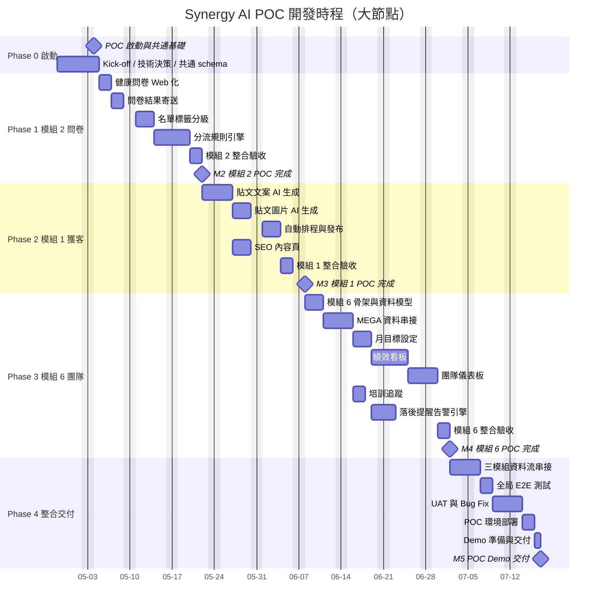
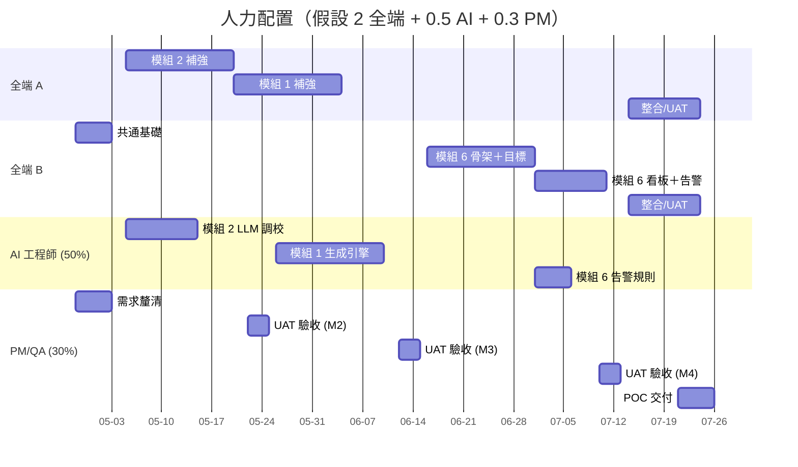

# Synergy AI POC — 甘特圖

> **週期：** 2026-04-28 ~ 2026-07-27（13 週）
> **格式：** Mermaid Gantt（GitHub / VS Code Mermaid preview 皆可渲染）

---

## 總覽甘特圖（Phase 層級）

---

## 週次時程表（對照用）

| 週次 | 日期範圍 | Phase | 主要工作 |
| :--- | :--- | :--- | :--- |
| W1 | 04-28 ~ 05-04 | Phase 0 | Kick-off、認證、UI 風格、DB schema |
| W2 | 05-05 ~ 05-11 | Phase 1 | 問卷 Web 化、結果寄送 |
| W3 | 05-12 ~ 05-18 | Phase 1 | 名單分級、分流規則（上） |
| W4 | 05-19 ~ 05-25 | Phase 1 | 分流規則（下）、整合驗收 **M2** |
| W5 | 05-26 ~ 06-01 | Phase 2 | AI 文案生成、AI 圖片生成（上） |
| W6 | 06-02 ~ 06-08 | Phase 2 | AI 圖片生成（下）、自動排程 |
| W7 | 06-09 ~ 06-15 | Phase 2 | SEO 內容頁、整合驗收 **M3** |
| W8 | 06-16 ~ 06-22 | Phase 3 | 模組 6 骨架、MEGA 串接 |
| W9 | 06-23 ~ 06-29 | Phase 3 | 月目標、績效看板（上） |
| W10 | 06-30 ~ 07-06 | Phase 3 | 績效看板（下）、團隊儀表板、培訓追蹤 |
| W11 | 07-07 ~ 07-13 | Phase 3 | 落後提醒、整合驗收 **M4** |
| W12 | 07-14 ~ 07-20 | Phase 4 | 三模組串接、E2E、UAT |
| W13 | 07-21 ~ 07-27 | Phase 4 | Bug Fix、部署、Demo 交付 **M5** |

---

## 關鍵里程碑

| 編號 | 日期 | 里程碑 | 交付產物 |
| :--- | :--- | :--- | :--- |
| **M1** | 2026-05-04 | POC 啟動完成 | 共通基礎、ADR、CI/CD |
| **M2** | 2026-05-25 | 模組 2（問卷）POC 完成 | 問卷→分級→分流可走通 |
| **M3** | 2026-06-15 | 模組 1（獲客）POC 完成 | AI 生文→排程→發佈可走通 |
| **M4** | 2026-07-13 | 模組 6（團隊）POC 完成 | 目標→看板→告警可走通 |
| **M5** | 2026-07-27 | POC Demo 交付 | 整合 Demo、部署、交付文件 |

---

## 資源配置視圖（人月）

---

## 使用方式

- **GitHub / GitLab：** 直接瀏覽本檔即可看到 Mermaid 圖
- **VS Code：** 安裝 *Markdown Preview Mermaid Support* 擴充
- **匯出 PNG：** 用 [Mermaid Live Editor](https://mermaid.live/) 貼上程式碼匯出
- **變更時程：** 僅需改 `dateFormat` 與各 task 的起訖；週次表隨之手動同步
